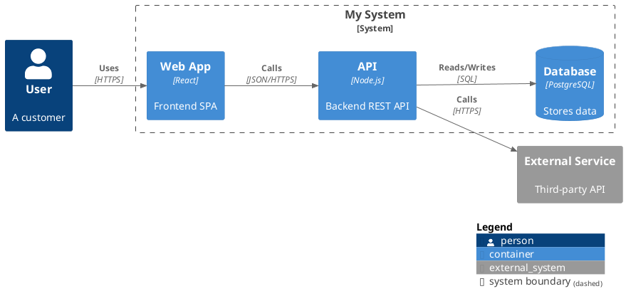

# Architecture Diagrams Skill

Generates architecture diagrams as code using either:
- **`diagrams` (mingrammer)** — Python library for cloud/infra diagrams → PNG/SVG output
- **C4-PlantUML** — PlantUML macros for C4 model diagrams (Context, Container, Component, Deployment)

## Decision: Which Engine to Use?

| Situation | Use |
|---|---|
| Cloud infra with AWS/Azure/GCP/K8s provider icons | `diagrams` (mingrammer) |
| C4 model (Context/Container/Component/Deployment) | C4-PlantUML |
| C4 diagram with cloud provider icons embedded | `diagrams` C4 node classes |
| Generic flowchart / sequence | C4-PlantUML sequence or generic |

If the user does not specify, ask. If the context makes it obvious (e.g., "AWS architecture"), decide silently.

---

## Workflow

### Step 1 — Understand the diagram

Identify:
- Diagram type: cloud infra / C4 level / sequence / flow
- Cloud provider (if any): AWS, Azure, GCP, K8s, OnPrem…
- Key components and their relationships
- Output format desired (PNG default for mingrammer; `.puml` for C4-PlantUML)

### Step 2 — Check environment preconditions

Run the setup checker script before generating any diagram:

```bash
python scripts/check_env.py
```

It will tell you what is installed and what is missing. Fix any missing dependencies before continuing.

### Step 3 — Generate the diagram code

**For `diagrams` (mingrammer):** Write a Python script (e.g., `diagram.py`) and run it.
**For C4-PlantUML:** Write a `.puml` file and render it with PlantUML.

See detailed instructions in:
- `references/diagrams-mingrammer.md` — Full guide for the `diagrams` library
- `references/c4-plantuml.md` — Full guide for C4-PlantUML

### Step 4 — Run and deliver output

For `diagrams`:
```bash
python diagram.py
# Output saved as <diagram_name>.png in the working directory
```

For C4-PlantUML:
```bash
java -jar plantuml.jar diagram.puml
# Or use the online server for quick rendering
```

Copy final output files to `/mnt/user-data/outputs/` and present them to the user.

---

## Quick Reference: `diagrams` (mingrammer)

```python
from diagrams import Diagram, Cluster, Edge
from diagrams.aws.compute import EC2, Lambda
from diagrams.aws.database import RDS, ElastiCache
from diagrams.aws.network import ELB, Route53, VPC

with Diagram("Web Service", show=False, direction="TB"):
    dns = Route53("DNS")
    lb  = ELB("Load Balancer")
    with Cluster("App Tier"):
        web = [EC2("web-1"), EC2("web-2")]
    db  = RDS("Postgres")
    cache = ElastiCache("Redis")
    dns >> lb >> web >> db
    web >> cache
```

Key parameters for `Diagram(...)`:
- `filename` — output file name (no extension)
- `outformat` — `"png"` (default), `"jpg"`, `"svg"`, `"pdf"`, `"dot"`
- `show=False` — prevent auto-opening in headless/server environments ← **always set this**
- `direction` — `"TB"` (top-bottom) or `"LR"` (left-right)
- `graph_attr` — dict of Graphviz attributes (e.g., `{"bgcolor": "transparent"}`)

Node naming pattern: `from diagrams.<provider>.<service> import <NodeClass>`
Supported providers: `aws`, `azure`, `gcp`, `k8s`, `onprem`, `digitalocean`, `firebase`, `elastic`, `programming`, `saas`, `c4`, `generic`, `gis`

Edges:
- `A >> B` — flow from A to B
- `A << B` — flow from B to A
- `A - B` — bidirectional / undirected
- `A >> Edge(label="HTTPS", color="red") >> B` — labelled edge

---

## Quick Reference: C4-PlantUML

Include the appropriate file depending on the C4 level:

| Diagram Level | Include |
|---|---|
| Context | `!include <C4/C4_Context>` |
| Container | `!include <C4/C4_Container>` |
| Component | `!include <C4/C4_Component>` |
| Deployment | `!include <C4/C4_Deployment>` |
| Dynamic | `!include <C4/C4_Dynamic>` |
| Sequence | `!include <C4/C4_Sequence>` |

Minimal container diagram:


Key macros:
- Elements: `Person()`, `Person_Ext()`, `System()`, `System_Ext()`, `Container()`, `ContainerDb()`, `Component()`
- Boundaries: `System_Boundary(alias, label)`, `Enterprise_Boundary(alias, label)`
- Relationships: `Rel(from, to, label)`, `Rel(from, to, label, technology)`, `BiRel()`
- Layout: `LAYOUT_TOP_DOWN()`, `LAYOUT_LEFT_RIGHT()`, `LAYOUT_LANDSCAPE()`
- Legend: `SHOW_LEGEND()`, `HIDE_STEREOTYPE()`

For extended reference, read `references/c4-plantuml.md`.

---

## Error Handling

| Error | Likely Cause | Fix |
|---|---|---|
| `ModuleNotFoundError: diagrams` | Library not installed | `pip install diagrams --break-system-packages` |
| `ExecutableNotFound: dot` | Graphviz not installed | See `scripts/check_env.py` output |
| `ImportError: cannot import name X` | Wrong node class name | Check provider docs at https://diagrams.mingrammer.com/docs/nodes/aws |
| `java: command not found` | Java not installed (PlantUML) | Install Java or use online server |
| PlantUML `!include` not found | Wrong stdlib path | Use `!include <C4/C4_Container>` (stdlib) not raw URL |

If unsure about which node class to use, check `references/diagrams-mingrammer.md` provider tables.
