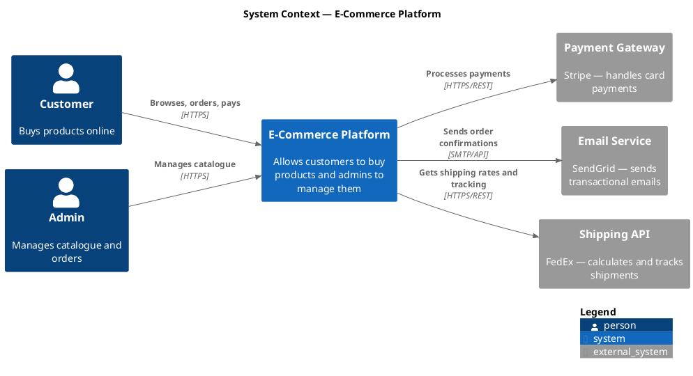
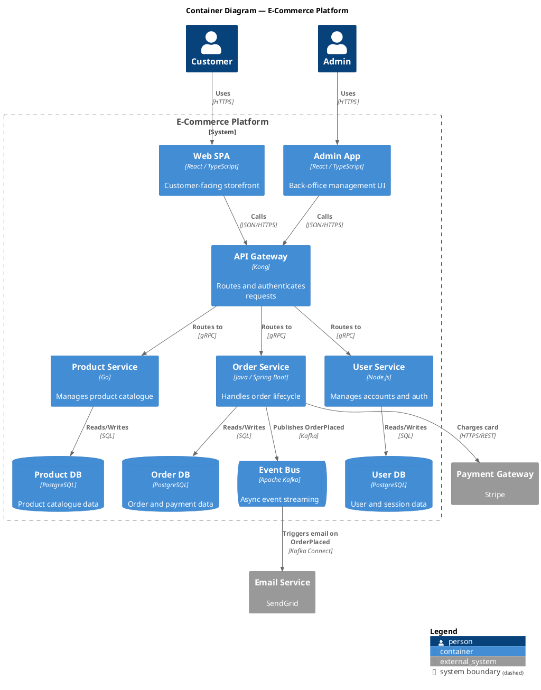
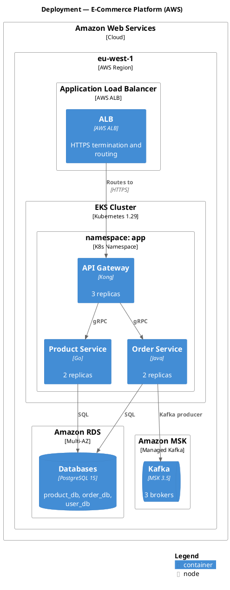

# C4-PlantUML — Detailed Reference

**Official repo:** https://github.com/plantuml-stdlib/C4-PlantUML  
**C4 model:** https://c4model.com  
**PlantUML online renderer:** https://www.plantuml.com/plantuml  
**Alternative renderer:** https://kroki.io

---

## Table of Contents
1. [C4 Model Overview](#1-c4-model-overview)
2. [Include Files](#2-include-files)
3. [Rendering Options](#3-rendering-options)
4. [Element Macros](#4-element-macros)
5. [Boundary Macros](#5-boundary-macros)
6. [Relationship Macros](#6-relationship-macros)
7. [Layout Directives](#7-layout-directives)
8. [Styling and Tags](#8-styling-and-tags)
9. [Full Examples by Level](#9-full-examples-by-level)

---

## 1. C4 Model Overview

| Level | Purpose | Include |
|---|---|---|
| **L1 — Context** | High-level: who uses the system, what external systems exist | `C4_Context` |
| **L2 — Container** | What deployable units make up the system (apps, DBs, services) | `C4_Container` |
| **L3 — Component** | What components are inside a container | `C4_Component` |
| **L4 — Code** | Class/entity level — usually skip in architecture docs | (UML tools) |
| **Deployment** | Where containers run (servers, cloud regions, clusters) | `C4_Deployment` |
| **Dynamic** | Sequence of interactions for a particular scenario | `C4_Dynamic` |

Use the lowest level of detail the audience needs. Teams typically maintain L1 + L2.

---

## 2. Include Files

Use the **stdlib include** (no internet required once PlantUML has the stdlib):

```plantuml
!include <C4/C4_Context>    ' Level 1
!include <C4/C4_Container>  ' Level 2 (also includes C4_Context macros)
!include <C4/C4_Component>  ' Level 3
!include <C4/C4_Deployment> ' Deployment
!include <C4/C4_Dynamic>    ' Dynamic / interaction
!include <C4/C4_Sequence>   ' Sequence variant
```

Alternatively, use the raw GitHub URL (requires internet access at render time):

```plantuml
!include https://raw.githubusercontent.com/plantuml-stdlib/C4-PlantUML/master/C4_Container.puml
```

**Prefer the stdlib form** (`!include <C4/C4_Container>`) for offline and CI use.

---

## 3. Rendering Options

### Option A — Local PlantUML JAR

```bash
# Download from https://github.com/plantuml/plantuml/releases
java -jar plantuml.jar diagram.puml
# Produces diagram.png by default

# SVG output
java -jar plantuml.jar -tsvg diagram.puml

# Specific output directory
java -jar plantuml.jar -o ./output diagram.puml
```

### Option B — Online server

Paste `.puml` content at: https://www.plantuml.com/plantuml/uml/

### Option C — VS Code

Install the "PlantUML" extension (jebbs.plantuml). Press Alt+D to preview.

### Option D — Kroki (REST API)

```bash
# Send .puml and receive PNG
curl -s -o diagram.png \
  --data-urlencode "diagram@diagram.puml" \
  https://kroki.io/plantuml/png
```

---

## 4. Element Macros

### Context elements
```plantuml
Person(alias, "label", "description")
Person_Ext(alias, "label", "description")   ' External person (lighter color)
System(alias, "label", "description")
System_Ext(alias, "label", "description")   ' External system
SystemDb(alias, "label", "description")     ' System shown as database cylinder
SystemQueue(alias, "label", "description")  ' System shown as queue
```

### Container elements (use inside System_Boundary)
```plantuml
Container(alias, "label", "technology", "description")
ContainerDb(alias, "label", "technology", "description")
ContainerQueue(alias, "label", "technology", "description")
Container_Ext(alias, "label", "technology", "description")
```

### Component elements (use inside Container_Boundary)
```plantuml
Component(alias, "label", "technology", "description")
ComponentDb(alias, "label", "technology", "description")
ComponentQueue(alias, "label", "technology", "description")
Component_Ext(alias, "label", "technology", "description")
```

### Deployment elements
```plantuml
Deployment_Node(alias, "label", "technology")
Deployment_Node(alias, "label", "technology", "description")
Node(alias, "label", "technology", "description")              ' Alias for Deployment_Node
Node_L(alias, "label", "technology", "description")            ' Node left-aligned
Node_R(alias, "label", "technology", "description")            ' Node right-aligned
```

### All macros accept optional `$tags` and `$link` parameters
```plantuml
Container(api, "API", "Node.js", "REST API", $tags="highlighted")
Person(user, "User", "Customer", $link="https://wiki.example.com/user")
```

---

## 5. Boundary Macros

```plantuml
System_Boundary(alias, "label") {
    ' containers go here
}

Enterprise_Boundary(alias, "label") {
    ' systems go here
}

Container_Boundary(alias, "label") {
    ' components go here
}

' Deployment boundaries
Deployment_Node(dc, "Data Centre", "Location") {
    Deployment_Node(k8s, "K8s Cluster", "Kubernetes 1.28") {
        Container(api, "API", "Node.js", "REST API")
    }
}
```

---

## 6. Relationship Macros

```plantuml
Rel(from, to, "label")
Rel(from, to, "label", "technology")
Rel_D(from, to, "label")    ' Down
Rel_U(from, to, "label")    ' Up
Rel_L(from, to, "label")    ' Left
Rel_R(from, to, "label")    ' Right
Rel_Back(from, to, "label") ' Reverse arrow direction
BiRel(from, to, "label")    ' Bidirectional
BiRel_D(from, to, "label")
BiRel_U(from, to, "label")
BiRel_L(from, to, "label")
BiRel_R(from, to, "label")
```

---

## 7. Layout Directives

```plantuml
LAYOUT_TOP_DOWN()           ' Default
LAYOUT_LEFT_RIGHT()         ' Rotate 90°
LAYOUT_LANDSCAPE()          ' Wide format
LAYOUT_WITH_LEGEND()        ' Show legend inline
LAYOUT_AS_SKETCH()          ' Sketch / hand-drawn look

SHOW_LEGEND()               ' Add legend at bottom
HIDE_STEREOTYPE()           ' Remove [stereotype] labels from elements
SHOW_FLOATING_LEGEND()      ' Legend in a floating box
```

Use `Lay_D`, `Lay_U`, `Lay_L`, `Lay_R` to control the *relative* layout of two specific elements:

```plantuml
Lay_D(systemA, systemB)    ' Force systemA above systemB
Lay_R(personA, systemA)    ' Force personA to the left of systemA
```

---

## 8. Styling and Tags

### Custom element tags

```plantuml
AddElementTag("microservice", $bgColor="#0e5a8a", $fontColor="#ffffff", $borderColor="#0e5a8a", $legendText="Microservice")
AddElementTag("deprecated",   $bgColor="#888888", $legendText="Deprecated service")

Container(svc, "My Service", "Go", "Core API", $tags="microservice")
```

### Custom relationship tags

```plantuml
AddRelTag("async",    $textColor="orange", $lineColor="orange", $lineStyle=DashedLine())
AddRelTag("internal", $lineColor="gray")

Rel(a, b, "publishes", "Kafka", $tags="async")
```

### Update default styles

```plantuml
UpdateElementStyle("person", $bgColor="#08427B", $fontColor="#ffffff")
UpdateElementStyle("system", $bgColor="#1168BD")
UpdateRelStyle(a, b, $textColor="red", $lineColor="red")
```

### Themes

```plantuml
!theme C4_superhero from <C4/themes>
!include <C4/C4_Container>
```

Available built-in C4 themes: `C4_united`, `C4_superhero`, `C4_cerulean`, `C4_sandstone`

---

## 9. Full Examples by Level

### L1 — System Context



### L2 — Container Diagram



### Deployment Diagram


