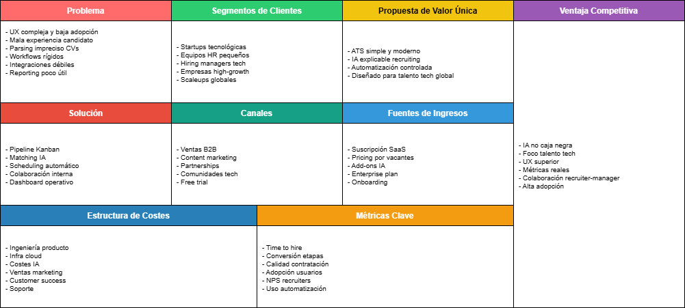
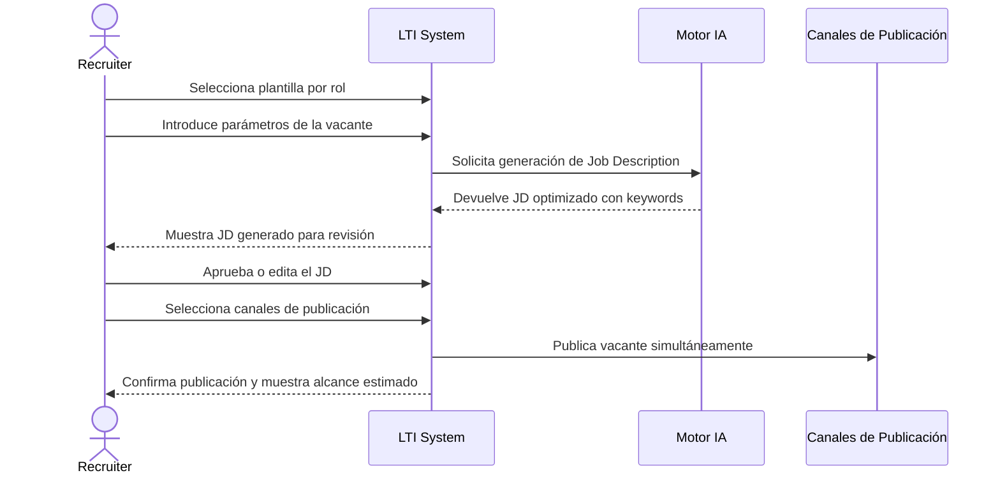
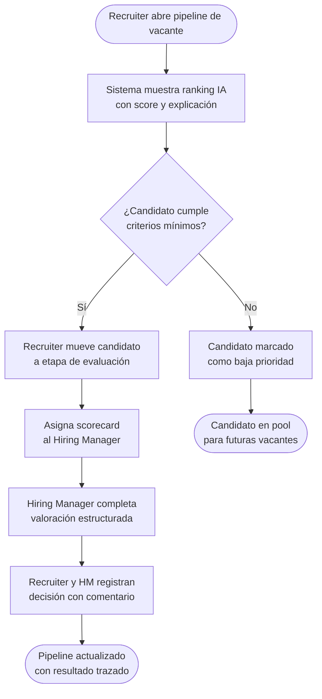
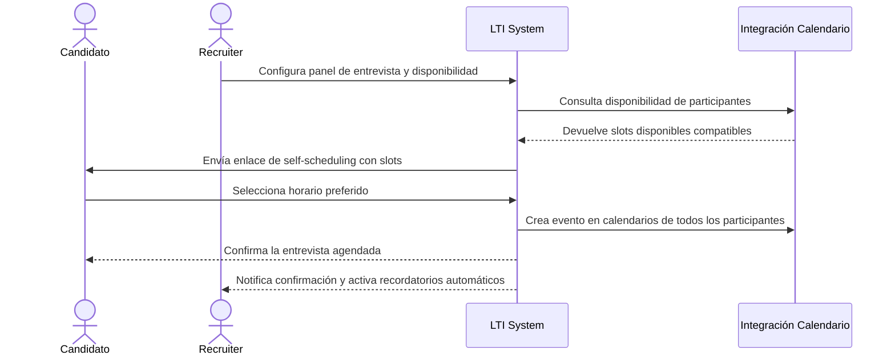
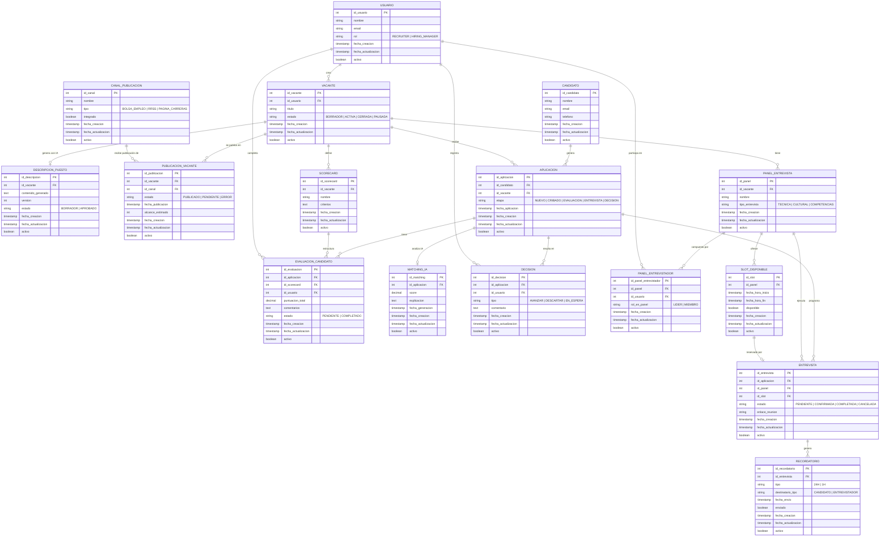
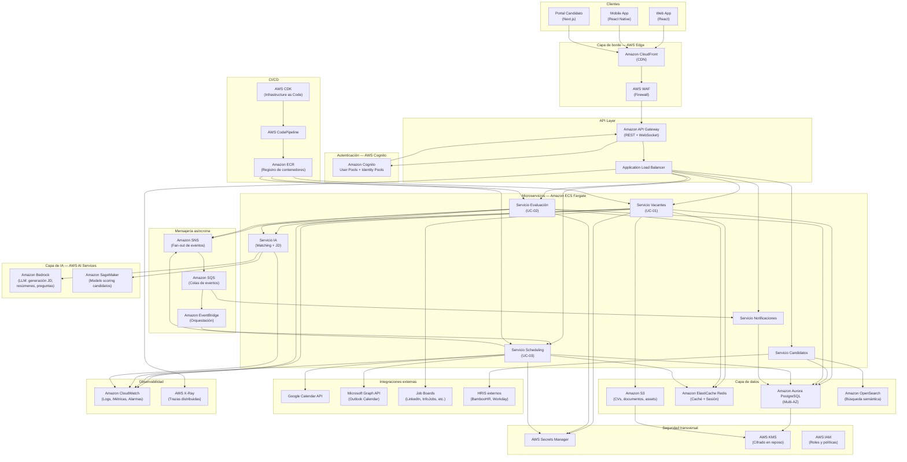

# Product Requirements Document – Sistema ATS (LTI)

## Índice
1. [Descripción breve del software LTI](#1-descripci%C3%B3n-breve-del-software-lti)
2. [Valor añadido y ventajas competitivas](#2-valor-a%C3%B1adido-y-ventajas-competitivas)
3. [Funciones principales del sistema](#3-funciones-principales-del-sistema)
    - [3.0 Análisis de CVs y perfilado de candidatos impulsado por IA](#30-an%C3%A1lisis-de-cvs-y-perfilado-de-candidatos-impulsado-por-ia)
    - [3.1 Gestión de candidatos y sourcing](#31-gesti%C3%B3n-de-candidatos-y-sourcing)
    - [3.2 Gestión de vacantes](#32-gesti%C3%B3n-de-vacantes)
    - [3.3 Pipeline de reclutamiento](#33-pipeline-de-reclutamiento)
    - [3.4 Screening y evaluación](#34-screening-y-evaluaci%C3%B3n)
    - [3.5 Entrevistas y scheduling](#35-entrevistas-y-scheduling)
    - [3.6 Colaboración y comunicación](#36-colaboraci%C3%B3n-y-comunicaci%C3%B3n)
    - [3.7 Automatización y workflows](#37-automatizaci%C3%B3n-y-workflows)
    - [3.8 Inteligencia artificial](#38-inteligencia-artificial)
    - [3.9 Analytics y reporting](#39-analytics-y-reporting)
    - [3.10 Integraciones y plataforma](#310-integraciones-y-plataforma)
4. [Lean Canvas](#4-lean-canvas)
5. [Casos de uso](#5-casos-de-uso)
    - [UC-01: Publicación de vacante asistida por IA](#uc-01-publicaci%C3%B3n-de-vacante-asistida-por-ia)
    - [UC-02: Evaluación y matching inteligente de candidatos](#uc-02-evaluaci%C3%B3n-y-matching-inteligente-de-candidatos)
    - [UC-03: Agendamiento self-service de entrevista](#uc-03-agendamiento-self-service-de-entrevista)
6. [Diagrama Entidad-Relación (ER)](#6-diagrama-entidad-relaci%C3%B3n-er)
7. [Diagrama de Arquitectura](#7-diagrama-de-arquitectura)
8. [C4 Diagrama de Contenedores](#7-c4-diagrama-de-contenedores)
    - [Context Diagram](#context-diagram)
    - [Container Diagram](#container-diagram)
    - [Component Diagram – AI Microservices](#component-diagram--ai-microservices)

---

## 1. Descripción breve del software LTI

LTI es un sistema ATS (Applicant Tracking System) diseñado para startups tecnológicas globales que buscan optimizar sus procesos de reclutamiento. Su enfoque principal es simplificar la operación diaria de recruiters y hiring managers, mejorar la experiencia del candidato y aumentar la calidad de contratación mediante automatización inteligente, colaboración centralizada e inteligencia artificial explicable.

El sistema actúa como una plataforma unificada donde se gestionan vacantes, candidatos, entrevistas, decisiones y métricas, eliminando la fragmentación de herramientas y procesos paralelos.

---

## 2. Valor añadido y ventajas competitivas

LTI se diferencia de los ATS tradicionales en los siguientes aspectos clave:

### Simplicidad operativa real
- Interfaces intuitivas diseñadas para usuarios no técnicos.
- Reducción significativa de la curva de aprendizaje.
- Flujos optimizados con pocas acciones para tareas críticas.

### Colaboración centralizada
- Reclutadores y hiring managers trabajan en un único sistema.
- Eliminación de comunicación dispersa (email, Slack, hojas de cálculo).
- Trazabilidad completa de decisiones y feedback.

### Automatización útil y controlada
- Motor no-code enfocado en tareas repetitivas (no decisiones críticas).
- Transparencia total (logs, override manual).
- Mejora del time-to-hire sin perder control humano.

### IA asistiva y explicable
- Matching inteligente con justificación (no caja negra).
- Generación de contenido (JD, resúmenes, preguntas).
- Priorización de candidatos basada en contexto real, no solo keywords.

### Datos accionables
- Dashboards operativos claros (no solo exportación de datos).
- Métricas orientadas a negocio (no solo HR).
- Identificación rápida de cuellos de botella.

### Experiencia de candidato mejorada
- Procesos simples, claros y mobile-friendly.
- Scheduling self-service.
- Comunicación más rápida y consistente.

### Integración y extensibilidad
- Integraciones con herramientas clave (calendar, HRIS, evaluaciones técnicas).
- API y webhooks para ecosistema tecnológico.
- Eliminación de silos de información.

---

## 3. Funciones principales del sistema

### 3.0 Análisis de CVs y perfilado de candidatos impulsado por IA:
Extracción y estructuración automática de información de candidatos desde currículums mediante inteligencia artificial, garantizando evaluaciones rápidas y precisas.

### 3.1 Gestión de candidatos y sourcing
- Importación de candidatos desde múltiples fuentes.
- Base de talento centralizada con tagging estructurado.
- Búsqueda semántica por skills y experiencia.
- Recomendaciones automáticas desde la base existente.

---

### 3.2 Gestión de vacantes
- Creación de vacantes con plantillas especializadas.
- Publicación multicanal desde un solo punto.
- Página de carreras personalizable.
- Librería de job descriptions optimizadas.

---

### 3.3 Pipeline de reclutamiento
- Vista Kanban por vacante con drag & drop.
- Etapas configurables del proceso.
- Acciones rápidas sobre candidatos (mover, comentar, evaluar).
- Visualización clara del estado del funnel.

---

### 3.4 Screening y evaluación
- Scorecards estructurados por rol.
- Preguntas knockout configurables.
- Ranking automático de candidatos.
- Evaluación consistente entre entrevistadores.

---

### 3.5 Entrevistas y scheduling
- Integración con calendarios (Google/Outlook).
- Self-scheduling para candidatos.
- Paneles de entrevista predefinidos.
- Recordatorios automáticos.

---

### 3.6 Colaboración y comunicación
- Comentarios en hilo por candidato.
- Sistema de decisiones estructuradas.
- Inbox unificado de comunicación.
- Notificaciones integradas con herramientas externas.

---

### 3.7 Automatización y workflows
- Motor visual no-code (trigger → acción).
- Automatización de tareas repetitivas.
- Secuencias de nurturing.
- Gestión de base de datos (limpieza, consentimiento).

---

### 3.8 Inteligencia artificial
- Generación de job descriptions.
- Matching candidato–vacante con explicación.
- Resúmenes automáticos para hiring managers.
- Generación de preguntas de entrevista.
- Recomendaciones sobre el pipeline.

---

### 3.9 Analytics y reporting
- Dashboard de funnel de reclutamiento.
- Métricas de time-to-hire y conversiones.
- Análisis de fuentes de talento.
- Seguimiento de SLA de feedback.

---

### 3.10 Integraciones y plataforma
- Integraciones con herramientas externas clave.
- API abierta.
- Webhooks para eventos.
- Sincronización con sistemas de HR.

## 4. Lean Canvas
Este es el Lean Canvas que resume la propuesta de valor, segmentos de clientes, canales, fuentes de ingresos, estructura de costos, métricas clave y ventajas competitivas del sistema ATS LTI.


## 5. Casos de uso

### UC-01: Publicación de vacante asistida por IA

**Actor principal:** Recruiter  
**Objetivo:** Crear y publicar una vacante optimizada en múltiples canales con el apoyo del motor de IA del sistema, reduciendo el tiempo de elaboración del job description.

**Precondiciones:**
- El Recruiter tiene una necesidad de contratación aprobada.
- El sistema tiene acceso a plantillas de vacantes y al motor de IA.

**Postcondiciones:**
- La vacante queda publicada en los canales seleccionados.
- El sistema comienza a recibir candidaturas y registra el origen.

**Flujo básico:**

1. El Recruiter accede al módulo de vacantes y selecciona una plantilla por rol.
2. Introduce los parámetros clave (título, requisitos mínimos, equipo, nivel).
3. El motor de IA genera un job description optimizado con keywords relevantes.
4. El Recruiter revisa, edita si necesario y aprueba el contenido.
5. Selecciona los canales de publicación (bolsas de empleo, página de carreras, LinkedIn).
6. El sistema publica simultáneamente y muestra un resumen de alcance estimado.

**Flujos alternativos:**
- Si el Recruiter rechaza el JD generado, puede solicitar una nueva versión con contexto adicional o editar manualmente.
- Si un canal de publicación no está integrado, el sistema muestra aviso y excluye ese canal.

**Diferenciador:** La generación automática de JDs con IA elimina el tiempo de redacción desde cero y garantiza contenido más atractivo y optimizado para búsqueda, algo que los ATS tradicionales no ofrecen.

**Impacto de negocio:** Reducción del time-to-publish de vacante de horas a minutos. Mayor calidad y consistencia del contenido publicado. Ampliación del alcance a múltiples canales desde un único punto.



---

### UC-02: Evaluación y matching inteligente de candidatos

**Actor principal:** Recruiter (secundario: Hiring Manager, Motor IA)  
**Objetivo:** Evaluar y priorizar candidatos de forma eficiente y objetiva usando el ranking automático con explicación de IA y scorecards estructurados.

**Precondiciones:**
- Existe una vacante activa con candidatos en el pipeline.
- Los scorecards y criterios de evaluación están configurados para el rol.

**Postcondiciones:**
- Los candidatos tienen un score asignado con justificación visible.
- El Hiring Manager ha revisado y registrado su decisión estructurada.

**Flujo básico:**

1. El Recruiter abre el pipeline Kanban de la vacante y accede a la vista de candidatos.
2. El sistema muestra el ranking automático generado por IA con score y explicación por candidato.
3. El Recruiter filtra candidatos por score y revisa los perfiles priorizados.
4. Mueve los candidatos seleccionados a la etapa de evaluación y asigna scorecards al Hiring Manager.
5. El Hiring Manager completa el scorecard con sus valoraciones estructuradas.
6. Ambos registran una decisión (avanzar / descartar / en espera) con comentario visible en el hilo.

**Flujos alternativos:**
- Si el Recruiter no está de acuerdo con el ranking de IA, puede sobreescribir manualmente la prioridad.
- Si el Hiring Manager no completa el scorecard en plazo, el sistema envía recordatorio automático.

**Diferenciador:** A diferencia de otros ATS, el matching de LTI es explicable: muestra al Recruiter por qué un candidato encaja (skills, experiencia, contexto), no solo un número opaco. Esto genera confianza y reduce el sesgo.

**Impacto de negocio:** Mejora de la calidad de contratación al reducir la subjetividad. Reducción del tiempo de cribado. Mayor alineación entre Recruiter y Hiring Manager gracias a decisiones trazadas y justificadas.



---

### UC-03: Agendamiento self-service de entrevista

**Actor principal:** Candidato (secundario: Recruiter, sistema de calendario)  
**Objetivo:** Permitir al candidato seleccionar autónomamente el horario de su entrevista, eliminando la coordinación manual y mejorando su experiencia.

**Precondiciones:**
- El candidato ha superado la fase de cribado y está listo para entrevistar.
- El Recruiter ha configurado el panel de entrevistadores y sus disponibilidades en el sistema.
- Las integraciones con calendarios (Google/Outlook) están activas.

**Postcondiciones:**
- La entrevista queda agendada en los calendarios de todos los participantes.
- Se envían recordatorios automáticos al candidato y al panel.

**Flujo básico:**

1. El Recruiter configura el panel de entrevista y consulta la disponibilidad de los participantes vía integración de calendario.
2. El sistema genera los slots disponibles compatibles con todos los participantes.
3. El candidato recibe un enlace de self-scheduling con los slots disponibles.
4. El candidato selecciona su horario preferido desde el enlace (sin necesidad de cuenta).
5. El sistema crea el evento en los calendarios de todos los participantes automáticamente.
6. Se activan recordatorios automáticos (24h y 1h antes) para el candidato y el panel.

**Flujos alternativos:**
- Si ningún slot disponible se ajusta al candidato, puede solicitar al Recruiter ampliar la disponibilidad.
- Si el candidato necesita reagendar, accede al mismo enlace para seleccionar un nuevo slot.

**Diferenciador:** El self-scheduling convierte al candidato en protagonista activo del proceso, eliminando el intercambio de emails y reduciendo drásticamente el time-to-interview. Es una funcionalidad clave para la experiencia de candidato en un mercado tecnológico competitivo.

**Impacto de negocio:** Reducción del tiempo de coordinación de entrevistas de días a horas. Mejora notable de la experiencia del candidato (NPS). Liberación de tiempo del Recruiter para tareas de mayor valor.



## 6. Diagrama Entidad-Relación (ER)
Este diagrama muestra las principales entidades del sistema ATS LTI, sus atributos clave y las relaciones entre ellas. Refleja la estructura de datos necesaria para soportar las funcionalidades descritas en los casos de uso, incluyendo la gestión de usuarios, candidatos, vacantes, aplicaciones, evaluaciones, entrevistas y decisiones.



## 7. Diagrama de Arquitectura
Este diagrama muestra la arquitectura técnica propuesta para el sistema ATS LTI, destacando los principales componentes, servicios, bases de datos, integraciones externas y flujos de comunicación entre ellos. La arquitectura está diseñada para ser escalable, segura y altamente disponible, utilizando servicios gestionados en la nube (AWS) y siguiendo buenas prácticas de diseño de software.



## 7. C4 Diagrama de Contenedores

### Context Diagram

Este diagrama de contexto (C1) muestra el sistema ATS LTI en su entorno, identificando los actores principales (recruiters, hiring managers, candidatos) y las integraciones clave con sistemas externos (calendarios, job boards, HRIS, email/SMS).

```plantuml
@startuml "C4_Context_ATS_LTI"
!include https://raw.githubusercontent.com/plantuml-stdlib/C4-PlantUML/master/C4_Context.puml

LAYOUT_TOP_DOWN()
LAYOUT_WITH_LEGEND()

title System Context – ATS LTI

Person(recruiter, "Recruiter", "Gestiona vacantes, candidatos y el pipeline de selección")
Person(hiring_manager, "Hiring Manager", "Evalúa candidatos y toma decisiones de contratación")
Person_Ext(candidato, "Candidato", "Postula a vacantes y agenda entrevistas de forma autónoma")

System(ats_lti, "ATS LTI", "Plataforma centralizada de gestión del proceso de reclutamiento con automatización e IA")

System_Ext(google_cal, "Google Calendar", "Gestión de disponibilidad y creación de eventos de entrevista")
System_Ext(outlook_cal, "Microsoft Outlook Calendar", "Gestión de disponibilidad y creación de eventos de entrevista")
System_Ext(job_boards, "Job Boards\n(LinkedIn, InfoJobs)", "Publicación multicanal de vacantes")
System_Ext(hris, "HRIS\n(BambooHR, Workday)", "Sincronización de datos de empleados y posiciones")
System_Ext(email_sms, "Proveedor Email/SMS\n(Amazon SES/SNS)", "Envío de notificaciones y recordatorios")

Rel(recruiter, ats_lti, "Crea vacantes, gestiona pipeline y evalúa candidatos", "HTTPS")
Rel(hiring_manager, ats_lti, "Completa scorecards y registra decisiones", "HTTPS")
Rel(candidato, ats_lti, "Postula a vacantes y selecciona slot de entrevista", "HTTPS")

Rel(ats_lti, google_cal, "Consulta disponibilidad y crea eventos", "HTTPS / Google Calendar API")
Rel(ats_lti, outlook_cal, "Consulta disponibilidad y crea eventos", "HTTPS / Microsoft Graph API")
Rel(ats_lti, job_boards, "Publica vacantes en múltiples canales", "HTTPS / REST API")
Rel(ats_lti, hris, "Sincroniza posiciones y datos de empleados", "HTTPS / REST API")
Rel(ats_lti, email_sms, "Envía notificaciones, recordatorios y comunicaciones", "HTTPS / SMTP")

@enduml
```

### Container Diagram
Este diagrama de contenedores (C2) detalla la arquitectura interna del sistema ATS LTI, mostrando los principales contenedores (web app, mobile app, servicios backend, bases de datos) y sus interacciones, así como las integraciones con sistemas externos.

```plantuml
@startuml "C4_Container_ATS_LTI"
!include https://raw.githubusercontent.com/plantuml-stdlib/C4-PlantUML/master/C4_Container.puml

LAYOUT_TOP_DOWN()
LAYOUT_WITH_LEGEND()

title Container Diagram – ATS LTI

Person(recruiter, "Recruiter", "Gestiona vacantes y pipeline")
Person(hiring_manager, "Hiring Manager", "Evalúa y decide sobre candidatos")
Person_Ext(candidato, "Candidato", "Postula y agenda entrevistas")

System_Ext(google_cal, "Google Calendar API")
System_Ext(outlook_cal, "Microsoft Graph API")
System_Ext(job_boards, "Job Boards")
System_Ext(hris, "HRIS")
System_Ext(email_sms, "Amazon SES / SNS")

System_Boundary(ats_lti, "ATS LTI – AWS Cloud") {

    Container(web_app, "Web App", "React, TypeScript", "Interfaz principal para Recruiters y Hiring Managers")
    Container(mobile_app, "Mobile App", "React Native", "Acceso móvil para Recruiters y Hiring Managers")
    Container(candidate_portal, "Portal del Candidato", "Next.js, TypeScript", "Portal self-service para candidatos: postulación y scheduling")

    Container(cdn_waf, "CloudFront + WAF", "Amazon CloudFront, AWS WAF", "CDN global y firewall de aplicación web")
    Container(cognito, "Auth Service", "Amazon Cognito", "Autenticación y autorización con tokens JWT")
    Container(api_gw, "API Gateway", "Amazon API Gateway", "Enrutamiento REST y WebSocket hacia microservicios")
    Container(alb, "Load Balancer", "AWS Application Load Balancer", "Distribución de tráfico hacia microservicios con health checks")

    Container(svc_vacantes, "Servicio Vacantes", "Node.js, Express, ECS Fargate", "UC-01: Gestión de vacantes, JD con IA y publicación multicanal")
    Container(svc_candidatos, "Servicio Candidatos", "Node.js, Express, ECS Fargate", "Gestión de la base de talento y sourcing")
    Container(svc_evaluacion, "Servicio Evaluación", "Node.js, Express, ECS Fargate", "UC-02: Matching IA, scorecards y decisiones estructuradas")
    Container(svc_scheduling, "Servicio Scheduling", "Node.js, Express, ECS Fargate", "UC-03: Gestión de paneles, slots y entrevistas self-service")
    Container(svc_notificaciones, "Servicio Notificaciones", "Node.js, ECS Fargate", "Envío de recordatorios y comunicaciones automatizadas")
    Container(svc_ia, "Servicio IA", "Python, FastAPI, ECS Fargate", "Generación de JD, matching candidato-vacante y resúmenes")

    Container(message_bus, "Bus de Mensajería", "Amazon SQS, SNS, EventBridge", "Comunicación asíncrona entre microservicios")

    ContainerDb(aurora_db, "Base de Datos Relacional", "Amazon Aurora PostgreSQL Multi-AZ", "Datos transaccionales: vacantes, candidatos, aplicaciones, entrevistas")
    ContainerDb(redis_cache, "Caché / Sesión", "Amazon ElastiCache Redis", "Caché de rankings, sesiones de usuario y slots disponibles")
    ContainerDb(s3_storage, "Almacenamiento de Objetos", "Amazon S3", "CVs, documentos adjuntos y assets estáticos")
    ContainerDb(opensearch, "Motor de Búsqueda", "Amazon OpenSearch", "Búsqueda semántica de candidatos por skills y experiencia")
    Container(bedrock, "LLM Service", "Amazon Bedrock", "Generación de job descriptions, resúmenes y preguntas de entrevista")
    Container(sagemaker, "Scoring Model", "Amazon SageMaker", "Modelo propio de scoring y matching candidato-vacante")
}

Rel(recruiter, cdn_waf, "Usa", "HTTPS")
Rel(hiring_manager, cdn_waf, "Usa", "HTTPS")
Rel(candidato, cdn_waf, "Usa", "HTTPS")

Rel(cdn_waf, web_app, "Sirve", "HTTPS")
Rel(cdn_waf, mobile_app, "Sirve", "HTTPS")
Rel(cdn_waf, candidate_portal, "Sirve", "HTTPS")
Rel(cdn_waf, api_gw, "Enruta peticiones API", "HTTPS")

Rel(web_app, api_gw, "Llama a", "HTTPS / REST, WebSocket")
Rel(mobile_app, api_gw, "Llama a", "HTTPS / REST")
Rel(candidate_portal, api_gw, "Llama a", "HTTPS / REST")

Rel(api_gw, cognito, "Valida tokens JWT", "HTTPS")
Rel(api_gw, alb, "Enruta hacia microservicios", "HTTP")

Rel(alb, svc_vacantes, "Enruta", "HTTP")
Rel(alb, svc_candidatos, "Enruta", "HTTP")
Rel(alb, svc_evaluacion, "Enruta", "HTTP")
Rel(alb, svc_scheduling, "Enruta", "HTTP")

Rel(svc_vacantes, aurora_db, "Lee y escribe", "SQL / port 5432")
Rel(svc_vacantes, s3_storage, "Almacena documentos", "AWS SDK")
Rel(svc_vacantes, svc_ia, "Solicita generación de JD", "HTTP / REST")
Rel(svc_vacantes, message_bus, "Publica eventos de vacante", "AWS SDK")
Rel(svc_vacantes, job_boards, "Publica vacantes", "HTTPS / REST API")

Rel(svc_candidatos, aurora_db, "Lee y escribe", "SQL / port 5432")
Rel(svc_candidatos, opensearch, "Indexa y busca candidatos", "HTTPS / REST")
Rel(svc_candidatos, s3_storage, "Almacena CVs", "AWS SDK")
Rel(svc_candidatos, hris, "Sincroniza datos", "HTTPS / REST API")

Rel(svc_evaluacion, aurora_db, "Lee y escribe", "SQL / port 5432")
Rel(svc_evaluacion, redis_cache, "Cachea rankings", "Redis protocol")
Rel(svc_evaluacion, svc_ia, "Solicita scoring y matching", "HTTP / REST")
Rel(svc_evaluacion, message_bus, "Publica decisiones y cambios de etapa", "AWS SDK")

Rel(svc_scheduling, aurora_db, "Lee y escribe", "SQL / port 5432")
Rel(svc_scheduling, redis_cache, "Cachea slots disponibles", "Redis protocol")
Rel(svc_scheduling, google_cal, "Consulta disponibilidad y crea eventos", "HTTPS / Google API")
Rel(svc_scheduling, outlook_cal, "Consulta disponibilidad y crea eventos", "HTTPS / Graph API")
Rel(svc_scheduling, message_bus, "Publica eventos de entrevista", "AWS SDK")

Rel(svc_notificaciones, aurora_db, "Lee estado de recordatorios", "SQL / port 5432")
Rel(svc_notificaciones, email_sms, "Envía emails y SMS", "HTTPS / SMTP")
Rel(message_bus, svc_notificaciones, "Entrega eventos de notificación", "AWS SDK")

Rel(svc_ia, bedrock, "Genera contenido con LLM", "HTTPS / AWS SDK")
Rel(svc_ia, sagemaker, "Invoca modelo de scoring", "HTTPS / AWS SDK")

@enduml
```

### Component Diagram – AI Microservices
Este diagrama de componentes (C3) se enfoca en el Servicio de Evaluación (UC-02), mostrando sus componentes internos (controladores, servicios de dominio, repositorios, adaptadores) y cómo interactúan entre sí y con otros sistemas (base de datos, servicio IA, bus de mensajería).

```plantuml
@startuml "C4_Component_EvaluacionService"
!include https://raw.githubusercontent.com/plantuml-stdlib/C4-PlantUML/master/C4_Component.puml

LAYOUT_TOP_DOWN()
LAYOUT_WITH_LEGEND()

title Component Diagram – Servicio de Evaluación (UC-02)

Container_Ext(alb, "Application Load Balancer", "AWS ALB", "Enruta peticiones HTTP al servicio")
Container_Ext(svc_ia, "Servicio IA", "Python, FastAPI", "Proporciona scoring y matching explicable")
ContainerDb_Ext(aurora_db, "Aurora PostgreSQL", "Base de datos relacional", "Almacena aplicaciones, scorecards y decisiones")
ContainerDb_Ext(redis_cache, "ElastiCache Redis", "Caché", "Rankings en memoria y caché de scorecards")
Container_Ext(message_bus, "Bus de Mensajería", "SQS / SNS / EventBridge", "Recibe y publica eventos de dominio")

Container_Boundary(svc_evaluacion, "Servicio de Evaluación – Node.js / ECS Fargate") {

    Component(pipeline_controller, "Pipeline Controller", "Express REST Controller", "Expone endpoints para gestionar la etapa de los candidatos en el pipeline")
    Component(scorecard_controller, "Scorecard Controller", "Express REST Controller", "Expone endpoints para crear y completar scorecards por vacante")
    Component(matching_controller, "Matching Controller", "Express REST Controller", "Expone endpoints para obtener el ranking IA y su explicación")
    Component(decision_controller, "Decision Controller", "Express REST Controller", "Expone endpoints para registrar decisiones estructuradas")

    Component(pipeline_service, "Pipeline Service", "Domain Service", "Lógica de negocio para cambios de etapa, validaciones y reglas del funnel")
    Component(scorecard_service, "Scorecard Service", "Domain Service", "Lógica de asignación de scorecards y cálculo de puntuación total")
    Component(matching_service, "Matching Service", "Domain Service", "Orquesta la llamada al Servicio IA y persiste el resultado explicable")
    Component(decision_service, "Decision Service", "Domain Service", "Valida y persiste decisiones, publica evento de dominio")

    Component(aplicacion_repo, "Aplicacion Repository", "Repository Pattern", "Acceso a datos de APLICACION en Aurora")
    Component(scorecard_repo, "Scorecard Repository", "Repository Pattern", "Acceso a datos de SCORECARD y EVALUACION_CANDIDATO en Aurora")
    Component(matching_repo, "Matching Repository", "Repository Pattern", "Acceso a datos de MATCHING_IA en Aurora y caché Redis")
    Component(decision_repo, "Decision Repository", "Repository Pattern", "Acceso a datos de DECISION en Aurora")

    Component(ia_adapter, "IA Adapter", "HTTP Client", "Adaptador para llamar al Servicio IA (scoring y matching)")
    Component(event_publisher, "Event Publisher", "AWS SDK SQS/SNS", "Publica eventos de dominio al bus de mensajería")
}

Rel(alb, pipeline_controller, "Enruta peticiones REST", "HTTP")
Rel(alb, scorecard_controller, "Enruta peticiones REST", "HTTP")
Rel(alb, matching_controller, "Enruta peticiones REST", "HTTP")
Rel(alb, decision_controller, "Enruta peticiones REST", "HTTP")

Rel(pipeline_controller, pipeline_service, "Delega lógica de negocio")
Rel(scorecard_controller, scorecard_service, "Delega lógica de negocio")
Rel(matching_controller, matching_service, "Delega lógica de negocio")
Rel(decision_controller, decision_service, "Delega lógica de negocio")

Rel(pipeline_service, aplicacion_repo, "Lee y actualiza etapa de aplicación")
Rel(pipeline_service, event_publisher, "Publica CandidatoAvanzado / CandidatoDescartado")

Rel(scorecard_service, scorecard_repo, "Lee scorecard y persiste evaluación")
Rel(scorecard_service, aplicacion_repo, "Verifica estado de la aplicación")

Rel(matching_service, ia_adapter, "Solicita score y explicación")
Rel(matching_service, matching_repo, "Persiste y recupera resultado de matching")

Rel(decision_service, decision_repo, "Persiste decisión estructurada")
Rel(decision_service, aplicacion_repo, "Actualiza etapa final")
Rel(decision_service, event_publisher, "Publica DecisionRegistrada")

Rel(aplicacion_repo, aurora_db, "SQL: APLICACION", "SQL / port 5432")
Rel(scorecard_repo, aurora_db, "SQL: SCORECARD, EVALUACION_CANDIDATO", "SQL / port 5432")
Rel(matching_repo, aurora_db, "SQL: MATCHING_IA", "SQL / port 5432")
Rel(matching_repo, redis_cache, "Caché de rankings por vacante", "Redis protocol")
Rel(decision_repo, aurora_db, "SQL: DECISION", "SQL / port 5432")

Rel(ia_adapter, svc_ia, "POST /score, POST /match", "HTTP / REST")
Rel(event_publisher, message_bus, "Publica eventos de dominio", "AWS SDK")

@enduml
```

## Code Diagram – Matching Service

El diagrama de código detalla la estructura interna del componente **Matching Service**, responsable de orquestar el scoring y matching de candidatos con IA explicable. Se muestran las clases principales, sus relaciones y responsabilidades.

```plantuml
@startuml "C4_Code_MatchingService"
!theme plain
skinparam linetype ortho
skinparam classAttributeIconSize 0
skinparam classFontStyle bold

title Code Diagram – Matching Service (UC-02)

package "API Layer" #DDDDDD {
    class MatchingController <<REST Controller>> {
        - matchingService: IMatchingService
        --
        + getMatchingScore(applicationId: string): MatchingResultDTO
        + getRankingByVacancy(vacancyId: string): MatchingResultDTO[]
        + refreshMatching(applicationId: string): MatchingResultDTO
    }
    
    class MatchingResultDTO <<DTO>> {
        + applicationId: string
        + candidateId: string
        + vacancyId: string
        + score: number
        + explanation: ExplanationDTO
        + generatedAt: Date
    }
    
    class ExplanationDTO <<DTO>> {
        + skillsMatch: SkillMatchDTO[]
        + experienceScore: number
        + educationScore: number
        + overallSummary: string
        + strengthsList: string[]
        + gapsList: string[]
    }
    
    class SkillMatchDTO <<DTO>> {
        + skillName: string
        + required: boolean
        + candidateLevel: string
        + matchPercentage: number
    }
}

package "Domain Layer" #E8F4E8 {
    interface IMatchingService <<interface>> {
        + calculateMatching(application: Application): Promise<MatchingResult>
        + getMatchingResult(applicationId: ApplicationId): Promise<MatchingResult>
        + getRankingForVacancy(vacancyId: VacancyId): Promise<MatchingResult[]>
        + invalidateCache(vacancyId: VacancyId): Promise<void>
    }
    
    class MatchingService <<Domain Service>> {
        - matchingRepository: IMatchingRepository
        - iaAdapter: IIAAdapter
        - scoringStrategy: IScoringStrategy
        - cacheManager: ICacheManager
        --
        + calculateMatching(application: Application): Promise<MatchingResult>
        + getMatchingResult(applicationId: ApplicationId): Promise<MatchingResult>
        + getRankingForVacancy(vacancyId: VacancyId): Promise<MatchingResult[]>
        + invalidateCache(vacancyId: VacancyId): Promise<void>
        - buildMatchingRequest(application: Application): MatchingRequest
        - mapToMatchingResult(response: IAResponse): MatchingResult
    }
    
    interface IScoringStrategy <<interface>> {
        + computeScore(candidate: Candidate, vacancy: Vacancy): ScoringInput
    }
    
    class WeightedScoringStrategy <<Strategy>> {
        - skillWeight: number
        - experienceWeight: number
        - educationWeight: number
        --
        + computeScore(candidate: Candidate, vacancy: Vacancy): ScoringInput
    }
    
    class MLScoringStrategy <<Strategy>> {
        - modelEndpoint: string
        --
        + computeScore(candidate: Candidate, vacancy: Vacancy): ScoringInput
    }
}

package "Domain Model" #FFF8E1 {
    class MatchingResult <<Entity>> {
        - id: MatchingId
        - applicationId: ApplicationId
        - score: Score
        - explanation: Explanation
        - generatedAt: Date
        - status: MatchingStatus
        --
        + isValid(): boolean
        + needsRefresh(): boolean
        + toDTO(): MatchingResultDTO
    }
    
    class Score <<Value Object>> {
        - value: number
        - confidence: number
        --
        + getValue(): number
        + getConfidence(): number
        + isHighConfidence(): boolean
        {static} + create(value: number, confidence: number): Score
    }
    
    class Explanation <<Value Object>> {
        - skillsAnalysis: SkillAnalysis[]
        - experienceScore: number
        - educationScore: number
        - summary: string
        - strengths: string[]
        - gaps: string[]
        --
        + getTopStrengths(n: number): string[]
        + getTopGaps(n: number): string[]
        + toDTO(): ExplanationDTO
    }
    
    class SkillAnalysis <<Value Object>> {
        - skillName: string
        - required: boolean
        - candidateLevel: SkillLevel
        - matchPercentage: number
        --
        + isCriticalGap(): boolean
        + toDTO(): SkillMatchDTO
    }
    
    enum MatchingStatus <<Enumeration>> {
        PENDING
        CALCULATED
        FAILED
        EXPIRED
    }
    
    enum SkillLevel <<Enumeration>> {
        NONE
        BEGINNER
        INTERMEDIATE
        ADVANCED
        EXPERT
    }
    
    class ApplicationId <<Value Object>> {
        - value: string
        --
        + getValue(): string
        {static} + create(value: string): ApplicationId
    }
    
    class VacancyId <<Value Object>> {
        - value: string
        --
        + getValue(): string
        {static} + create(value: string): VacancyId
    }
    
    class MatchingId <<Value Object>> {
        - value: string
        --
        + getValue(): string
        {static} + generate(): MatchingId
    }
}

package "Infrastructure Layer" #E3F2FD {
    interface IMatchingRepository <<interface>> {
        + save(result: MatchingResult): Promise<void>
        + findById(id: MatchingId): Promise<MatchingResult | null>
        + findByApplicationId(appId: ApplicationId): Promise<MatchingResult | null>
        + findByVacancyId(vacancyId: VacancyId): Promise<MatchingResult[]>
        + deleteExpired(): Promise<number>
    }
    
    class MatchingRepository <<Repository>> {
        - dbClient: DatabaseClient
        - cacheClient: CacheClient
        - mapper: MatchingMapper
        --
        + save(result: MatchingResult): Promise<void>
        + findById(id: MatchingId): Promise<MatchingResult | null>
        + findByApplicationId(appId: ApplicationId): Promise<MatchingResult | null>
        + findByVacancyId(vacancyId: VacancyId): Promise<MatchingResult[]>
        + deleteExpired(): Promise<number>
        - cacheKey(id: string): string
    }
    
    interface IIAAdapter <<interface>> {
        + requestMatching(request: MatchingRequest): Promise<IAResponse>
        + healthCheck(): Promise<boolean>
    }
    
    class IAAdapter <<Adapter>> {
        - httpClient: HttpClient
        - baseUrl: string
        - timeout: number
        - retryPolicy: RetryPolicy
        --
        + requestMatching(request: MatchingRequest): Promise<IAResponse>
        + healthCheck(): Promise<boolean>
        - handleError(error: Error): never
    }
    
    class MatchingRequest <<DTO>> {
        + candidateProfile: CandidateProfile
        + vacancyRequirements: VacancyRequirements
        + scoringInput: ScoringInput
    }
    
    class IAResponse <<DTO>> {
        + score: number
        + confidence: number
        + skillsAnalysis: object[]
        + experienceScore: number
        + educationScore: number
        + summary: string
        + strengths: string[]
        + gaps: string[]
    }
    
    interface ICacheManager <<interface>> {
        + get<T>(key: string): Promise<T | null>
        + set<T>(key: string, value: T, ttl: number): Promise<void>
        + invalidate(pattern: string): Promise<void>
    }
    
    class RedisCacheManager <<Infrastructure>> {
        - redisClient: RedisClient
        --
        + get<T>(key: string): Promise<T | null>
        + set<T>(key: string, value: T, ttl: number): Promise<void>
        + invalidate(pattern: string): Promise<void>
    }
}

' Relaciones API → Domain
MatchingController --> IMatchingService : uses
MatchingController ..> MatchingResultDTO : returns
MatchingResultDTO *-- ExplanationDTO
ExplanationDTO *-- SkillMatchDTO

' Relaciones Domain Service
IMatchingService <|.. MatchingService : implements
MatchingService --> IMatchingRepository : uses
MatchingService --> IIAAdapter : uses
MatchingService --> IScoringStrategy : uses
MatchingService --> ICacheManager : uses
IScoringStrategy <|.. WeightedScoringStrategy : implements
IScoringStrategy <|.. MLScoringStrategy : implements

' Relaciones Domain Model
MatchingResult *-- Score
MatchingResult *-- Explanation
MatchingResult *-- MatchingId
MatchingResult *-- ApplicationId
MatchingResult --> MatchingStatus
Explanation *-- SkillAnalysis
SkillAnalysis --> SkillLevel

' Relaciones Infrastructure
IMatchingRepository <|.. MatchingRepository : implements
IIAAdapter <|.. IAAdapter : implements
ICacheManager <|.. RedisCacheManager : implements
IAAdapter ..> MatchingRequest : sends
IAAdapter ..> IAResponse : receives
MatchingRepository --> MatchingResult : persists

@enduml
```



