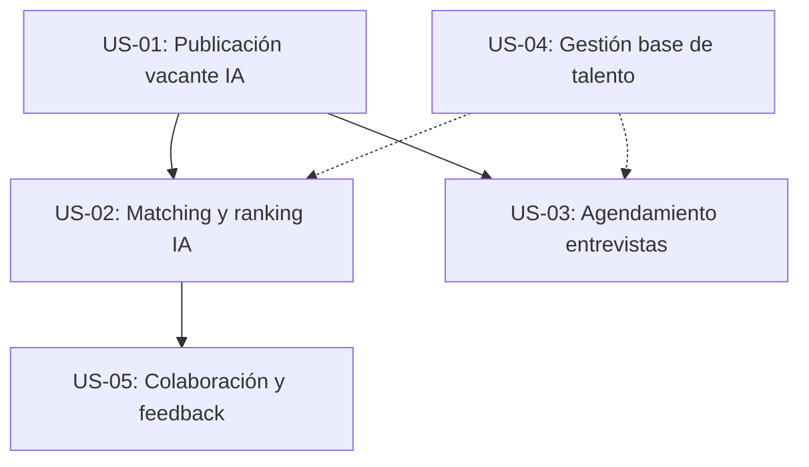

## US-01: Publicación de vacante asistida por IA

**Como** Recruiter,
**quiero** crear y publicar vacantes optimizadas en múltiples canales con ayuda de IA,
**para** reducir el tiempo de publicación y aumentar el alcance y la calidad de las ofertas.

**Criterios de Aceptación**
```gherkin
**Escenario 1:** Publicación exitosa en canales integrados
  Dado que tengo una necesidad de contratación aprobada
  Y accedo al módulo de vacantes
  Cuando genero y apruebo un job description con IA y selecciono canales
  Entonces la vacante se publica en todos los canales integrados
  Y recibo confirmación y alcance estimado

**Escenario 2:** Edición manual del job description
  Dado que el sistema genera un JD con IA
  Cuando no estoy conforme con el resultado
  Entonces puedo editarlo manualmente o solicitar una nueva versión

**Escenario 3:** Manejo de canales no integrados
  Dado que selecciono un canal no integrado
  Cuando intento publicar la vacante
  Entonces el sistema muestra un aviso y excluye ese canal
```

**Notas Técnicas**
- Depende de la integración con el motor de IA y canales externos
- Requiere plantillas de vacantes y API de publicación
- Datos de prueba: vacantes, canales integrados/no integrados
- Riesgo: integración con canales externos puede fallar

| Dimensión     | Valor | Justificación                                  |
|--------------|-------|------------------------------------------------|
| Complejidad  | M     | Integración IA y multicanal, pero acotado       |
| Story Points | 5     | Varias integraciones, lógica de negocio         |
| Valor de Negocio | Alto | Reduce time-to-hire y mejora calidad           |

| Criterio      | ✅/⚠️/❌ | Comentario                                    |
|---------------|---------|-----------------------------------------------|
| Independiente | ✅      | Puede desarrollarse sin otras US               |
| Negociable    | ✅      | Plantillas y canales pueden ampliarse          |
| Valiosa       | ✅      | Impacto directo en reclutamiento               |
| Estimable     | ✅      | Requisitos claros y acotados                   |
| Small         | ⚠️      | Puede requerir dividir si hay muchos canales   |
| Testable      | ✅      | Criterios claros y automatizables              |

---

## US-02: Matching inteligente y ranking explicable de candidatos

**Como** Recruiter,
**quiero** visualizar un ranking automático y explicable de candidatos para cada vacante,
**para** priorizar objetivamente y reducir el sesgo en la selección.

**Criterios de Aceptación**
```gherkin
**Escenario 1:** Visualización de ranking con explicación
  Dado que accedo al pipeline de una vacante con candidatos
  Cuando consulto el listado
  Entonces veo el score y explicación generada por IA para cada candidato

**Escenario 2:** Overwrite manual del ranking
  Dado que no estoy de acuerdo con el ranking automático
  Cuando lo modifico manualmente
  Entonces el sistema registra el cambio y la justificación

**Escenario 3:** Scorecards estructurados
  Dado que existen scorecards configurados
  Cuando asigno un scorecard a un Hiring Manager
  Entonces puede completar la evaluación estructurada
```

**Notas Técnicas**
- Depende de la existencia de candidatos y vacantes activas
- Integración con motor IA y módulo de scorecards
- Datos de prueba: candidatos con distintos perfiles
- Riesgo: explicabilidad IA y aceptación por usuarios

| Dimensión     | Valor | Justificación                                  |
|--------------|-------|------------------------------------------------|
| Complejidad  | M     | Algoritmo IA y lógica de justificación          |
| Story Points | 5     | IA, scorecards y lógica de ranking              |
| Valor de Negocio | Alto | Mejora calidad y objetividad de selección      |

| Criterio      | ✅/⚠️/❌ | Comentario                                    |
|---------------|---------|-----------------------------------------------|
| Independiente | ✅      | Puede desarrollarse tras US-01                 |
| Negociable    | ✅      | Algoritmo y criterios pueden evolucionar       |
| Valiosa       | ✅      | Reduce sesgo y mejora decisiones               |
| Estimable     | ✅      | Requisitos claros                              |
| Small         | ⚠️      | Puede requerir dividir IA y scorecards         |
| Testable      | ✅      | Ranking y logs verificables                    |

---

## US-03: Agendamiento self-service de entrevistas

**Como** Candidato,
**quiero** seleccionar el horario de mi entrevista desde un enlace self-service,
**para** agilizar la coordinación y mejorar mi experiencia en el proceso.

**Criterios de Aceptación**
```gherkin
**Escenario 1:** Recepción de enlace de agendamiento
  Dado que he superado la fase de cribado
  Cuando recibo el enlace de self-scheduling
  Entonces puedo ver los slots disponibles y seleccionar uno

**Escenario 2:** Confirmación automática y recordatorios
  Dado que selecciono un slot
  Cuando confirmo la entrevista
  Entonces el sistema agenda el evento y envía recordatorios automáticos

**Escenario 3:** Reagendamiento por el candidato
  Dado que necesito cambiar la cita
  Cuando accedo al mismo enlace
  Entonces puedo seleccionar un nuevo slot disponible
```

**Notas Técnicas**
- Depende de la integración con calendarios externos
- Requiere configuración previa de panel y slots
- Datos de prueba: candidatos, panel, slots
- Riesgo: sincronización de calendarios y notificaciones

| Dimensión     | Valor | Justificación                                  |
|--------------|-------|------------------------------------------------|
| Complejidad  | M     | Integración con calendarios y lógica de slots   |
| Story Points | 5     | Varias integraciones y lógica de negocio        |
| Valor de Negocio | Alto | Mejora experiencia y eficiencia                |

| Criterio      | ✅/⚠️/❌ | Comentario                                    |
|---------------|---------|-----------------------------------------------|
| Independiente | ✅      | Puede desarrollarse tras US-01                 |
| Negociable    | ✅      | Slots y panel pueden ajustarse                 |
| Valiosa       | ✅      | Impacto directo en experiencia candidato       |
| Estimable     | ✅      | Requisitos claros                              |
| Small         | ⚠️      | Puede requerir dividir integración             |
| Testable      | ✅      | Flujos y notificaciones verificables           |

---

## US-04: Gestión centralizada de candidatos y base de talento

**Como** Recruiter,
**quiero** importar y gestionar candidatos desde múltiples fuentes en una base centralizada,
**para** facilitar el sourcing y la búsqueda eficiente de talento.

**Criterios de Aceptación**
```gherkin
**Escenario 1:** Importación desde fuentes externas
  Dado que accedo al módulo de candidatos
  Cuando importo datos desde una fuente externa
  Entonces los candidatos se agregan a la base centralizada

**Escenario 2:** Búsqueda semántica y filtrado
  Dado que tengo una base de candidatos
  Cuando realizo una búsqueda por skills o experiencia
  Entonces obtengo resultados relevantes y priorizados

**Escenario 3:** Tagging estructurado
  Dado que gestiono la base de talento
  Cuando etiqueto candidatos
  Entonces puedo filtrar y segmentar fácilmente
```

**Notas Técnicas**
- Depende de integraciones con fuentes externas (LinkedIn, portales)
- Requiere motor de búsqueda semántica
- Datos de prueba: candidatos con distintos tags y skills
- Riesgo: calidad de datos importados

| Dimensión     | Valor | Justificación                                  |
|--------------|-------|------------------------------------------------|
| Complejidad  | M     | Integraciones y motor de búsqueda               |
| Story Points | 5     | Varias integraciones y lógica de filtrado       |
| Valor de Negocio | Alto | Facilita sourcing y reduce tiempo de búsqueda  |

| Criterio      | ✅/⚠️/❌ | Comentario                                    |
|---------------|---------|-----------------------------------------------|
| Independiente | ✅      | Puede desarrollarse tras US-01                 |
| Negociable    | ✅      | Fuentes y filtros pueden ampliarse             |
| Valiosa       | ✅      | Impacto directo en sourcing                    |
| Estimable     | ✅      | Requisitos claros                              |
| Small         | ⚠️      | Puede requerir dividir integraciones           |
| Testable      | ✅      | Flujos y búsquedas verificables                |

---

## US-05: Colaboración estructurada y feedback centralizado

**Como** Hiring Manager,
**quiero** registrar decisiones y feedback estructurado sobre candidatos en un hilo centralizado,
**para** asegurar trazabilidad y mejorar la colaboración con el equipo de reclutamiento.

**Criterios de Aceptación**
```gherkin
**Escenario 1:** Registro de decisión estructurada
  Dado que evalúo un candidato
  Cuando registro mi decisión (avanzar, descartar, en espera)
  Entonces el sistema almacena la decisión y comentario asociado

**Escenario 2:** Comentarios en hilo por candidato
  Dado que reviso un perfil
  Cuando agrego un comentario
  Entonces todos los usuarios autorizados pueden verlo y responder

**Escenario 3:** Notificaciones integradas
  Dado que se registra una decisión o comentario
  Cuando soy parte del proceso
  Entonces recibo una notificación integrada
```

**Notas Técnicas**
- Depende de la existencia de candidatos y pipeline activo
- Requiere módulo de comentarios y notificaciones
- Datos de prueba: candidatos, decisiones, comentarios
- Riesgo: gestión de permisos y notificaciones

| Dimensión     | Valor | Justificación                                  |
|--------------|-------|------------------------------------------------|
| Complejidad  | M     | Lógica de comentarios y notificaciones          |
| Story Points | 5     | Módulo de feedback y permisos                   |
| Valor de Negocio | Alto | Mejora colaboración y trazabilidad             |

| Criterio      | ✅/⚠️/❌ | Comentario                                    |
|---------------|---------|-----------------------------------------------|
| Independiente | ✅      | Puede desarrollarse tras US-02                 |
| Negociable    | ✅      | Formato y notificaciones pueden evolucionar    |
| Valiosa       | ✅      | Impacto directo en colaboración                |
| Estimable     | ✅      | Requisitos claros                              |
| Small         | ⚠️      | Puede requerir dividir notificaciones          |
| Testable      | ✅      | Flujos y comentarios verificables              |

---

## Matriz de Priorización MVP

| ID    | User Story                                         | Valor Negocio | Esfuerzo | Riesgo | Prioridad MoSCoW | Orden |
|-------|----------------------------------------------------|---------------|----------|--------|------------------|-------|
| US-01 | Publicación de vacante asistida por IA             | Alto          | M        | Medio  | Must             | 1     |
| US-02 | Matching inteligente y ranking explicable           | Alto          | M        | Medio  | Must             | 2     |
| US-03 | Agendamiento self-service de entrevistas           | Alto          | M        | Medio  | Must             | 3     |
| US-04 | Gestión centralizada de candidatos y base de talento| Alto          | M        | Medio  | Should           | 4     |
| US-05 | Colaboración estructurada y feedback centralizado  | Alto          | M        | Medio  | Should           | 5     |

---

### Justificación de Priorización

1. **Dependencias técnicas:** US-01 es base para el resto (vacantes y candidatos). US-02 y US-03 requieren vacantes y candidatos activos. US-05 depende de tener pipeline y decisiones.
2. **Valor de negocio:** Las tres primeras (US-01, US-02, US-03) son el core del MVP y generan impacto inmediato en time-to-hire y experiencia de usuario.
3. **Riesgo técnico:** Las integraciones externas (IA, calendarios, canales) se validan pronto. Feedback y colaboración (US-05) pueden evolucionar tras validar el flujo principal.
4. **Quick wins:** US-01 y US-02 son quick wins por su impacto y visibilidad.

---

### Mapa de Dependencias



---
