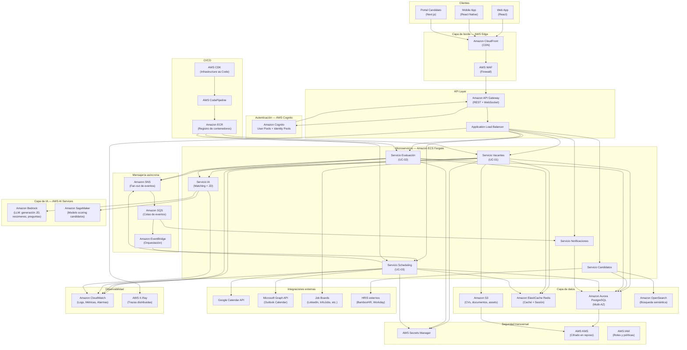

# Arquitectura del Sistema ATS LTI

---

## Resumen de decisiones de diseño

La arquitectura del sistema LTI sigue un **patrón de microservicios** desplegado íntegramente en AWS. Cada dominio funcional identificado en el modelo de datos (vacantes, candidatos, evaluación, scheduling) se encapsula en un microservicio independiente, lo que permite escalar, desplegar y mantener cada capacidad de forma autónoma. La comunicación entre servicios internos usa una combinación de llamadas síncronas vía API Gateway (REST/GraphQL para operaciones de usuario) y mensajería asíncrona vía Amazon SQS/SNS para eventos del pipeline (candidato avanzado, entrevista confirmada, recordatorio activado), desacoplando los componentes y garantizando resiliencia.

El acceso de los clientes (aplicación web y mobile) se enruta a través de Amazon CloudFront (CDN) con AWS WAF para protección perimetral, seguido de un Application Load Balancer que distribuye el tráfico hacia los microservicios desplegados en Amazon ECS con Fargate. La capa de datos combina Amazon Aurora PostgreSQL (datos transaccionales relacionales del modelo ER) con Amazon ElastiCache Redis para caché de sesión, rankings de candidatos y slots de disponibilidad. El motor de IA (matching, generación de JD) se expone como servicio independiente apoyado en Amazon Bedrock para los modelos de lenguaje y Amazon SageMaker para los modelos de scoring propios.

La seguridad se gestiona de forma transversal: autenticación y autorización delegadas a Amazon Cognito con tokens JWT, secretos en AWS Secrets Manager, tráfico cifrado en tránsito (TLS 1.3) y en reposo (KMS). La observabilidad se cubre con Amazon CloudWatch (métricas, logs, alarmas) y AWS X-Ray (trazas distribuidas). El despliegue sigue principios de Infrastructure as Code con AWS CDK y pipelines CI/CD en AWS CodePipeline, garantizando mantenibilidad y reproducibilidad de entornos.

---

## Diagrama de arquitectura



---

## Prompt para DiagramsGPT

```text
Create a high-level cloud architecture diagram for an ATS (Applicant Tracking System) called LTI, 
deployed entirely on AWS. The system follows a microservices pattern with the following components:

CLIENTS LAYER:
- Web App (React), Mobile App (React Native), Candidate Portal (Next.js)

EDGE LAYER:
- Amazon CloudFront (CDN) in front of all traffic
- AWS WAF (Web Application Firewall) for perimeter protection

AUTHENTICATION:
- Amazon Cognito (User Pools + Identity Pools) for JWT-based auth

API LAYER:
- Amazon API Gateway (REST + WebSocket)
- Application Load Balancer routing to microservices

MICROSERVICES (Amazon ECS Fargate):
- Vacancies Service (UC-01: AI-assisted job posting)
- Candidates Service (talent database and sourcing)
- Evaluation Service (UC-02: AI matching and scorecards)
- Scheduling Service (UC-03: candidate self-scheduling)
- Notifications Service (automated reminders and alerts)
- AI Service (matching engine and JD generation)

ASYNC MESSAGING:
- Amazon SQS (event queues)
- Amazon SNS (event fan-out)
- Amazon EventBridge (workflow orchestration)

DATA LAYER:
- Amazon Aurora PostgreSQL Multi-AZ (main relational database)
- Amazon ElastiCache Redis (cache, sessions, candidate rankings)
- Amazon S3 (CVs, documents, static assets)
- Amazon OpenSearch (semantic search for candidates)

AI LAYER:
- Amazon Bedrock (LLM for JD generation, summaries, interview questions)
- Amazon SageMaker (custom candidate scoring model)

EXTERNAL INTEGRATIONS:
- Google Calendar API and Microsoft Graph API (scheduling)
- Job Boards (LinkedIn, InfoJobs)
- HRIS systems (BambooHR, Workday)

SECURITY (cross-cutting):
- AWS Secrets Manager (credentials)
- AWS KMS (encryption at rest)
- AWS IAM (roles and policies)

OBSERVABILITY:
- Amazon CloudWatch (logs, metrics, alarms)
- AWS X-Ray (distributed tracing)

CI/CD:
- AWS CodePipeline + AWS CDK (Infrastructure as Code) + Amazon ECR

Key flows to highlight:
1. Client → CloudFront → WAF → API Gateway → Cognito (auth) → ALB → Microservices
2. Vacancies Service → AI Service → Amazon Bedrock (JD generation, UC-01)
3. Evaluation Service → AI Service → SageMaker (candidate scoring, UC-02)
4. Scheduling Service → Google Calendar / Outlook → SNS → SQS → Notifications Service (UC-03)

Use AWS official icon style. Show the three main use case flows with different colors or annotations.
Group components into labeled swim lanes or zones by layer.
```

---

*Documento generado el 21 de abril de 2026 para el sistema ATS LTI.*
