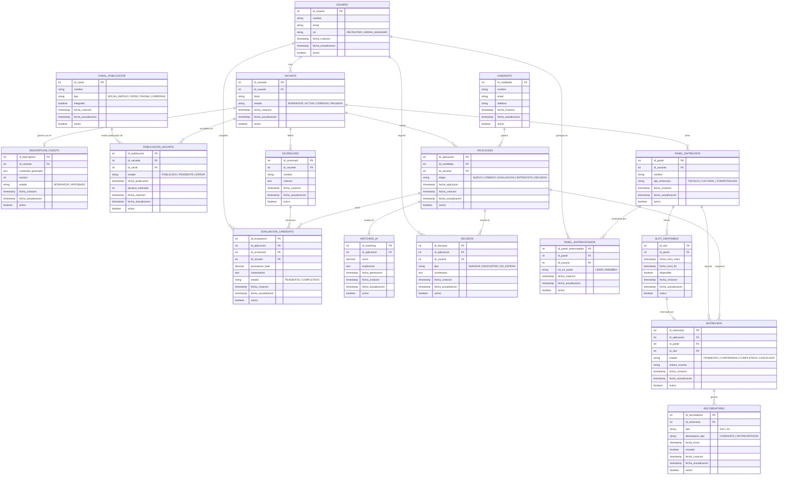

# Diagrama Entidad-Relación – Sistema ATS LTI

---

## Resumen de configuración

| Parámetro | Valor seleccionado |
|---|---|
| Idioma | Español |
| Alcance | Los 3 casos de uso principales (UC-01, UC-02, UC-03) |
| Nivel de detalle | Estándar |
| Notación | Crow's Foot |
| Formato | Descripción + Diagrama Mermaid |
| Restricciones | Soft delete (`activo`), auditoría (`fecha_creacion`, `fecha_actualizacion`), 3NF |

---

## Resumen del dominio modelado

El modelo cubre las entidades necesarias para los tres casos de uso identificados en el sistema ATS LTI. El dominio parte de una entidad central **USUARIO** que representa tanto al Recruiter como al Hiring Manager (diferenciados por el atributo `rol`), y una entidad **CANDIDATO** que representa a los postulantes externos.

El flujo de UC-01 (publicación de vacante con IA) introduce las entidades **VACANTE**, **DESCRIPCION_PUESTO** (el JD generado por IA) y la relación N:M entre VACANTE y **CANAL_PUBLICACION** materializada en **PUBLICACION_VACANTE**. El flujo de UC-02 (evaluación y matching inteligente) introduce **APLICACION** como eje del pipeline, junto con **SCORECARD**, **EVALUACION_CANDIDATO**, **MATCHING_IA** y **DECISION**. El flujo de UC-03 (agendamiento self-service) introduce **PANEL_ENTREVISTA**, la tabla de unión **PANEL_ENTREVISTADOR**, **SLOT_DISPONIBLE**, **ENTREVISTA** y **RECORDATORIO**.

Las relaciones N:M se han descompuesto explícitamente en tablas de unión. Todas las entidades siguen el estándar de auditoría y soft delete. El modelo está en tercera forma normal (3NF), sin atributos compuestos ni redundancias.

---

## Diagrama Entidad-Relación

---

## Diccionario de datos

### USUARIO
Representa a los usuarios internos del sistema: Recruiters y Hiring Managers. El campo `rol` diferencia ambos tipos sin necesidad de tablas separadas.

| Atributo | Tipo | Restricción | Descripción |
|---|---|---|---|
| id_usuario | INT | PK | Identificador único |
| nombre | VARCHAR(150) | NOT NULL | Nombre completo |
| email | VARCHAR(255) | NOT NULL, UNIQUE | Correo corporativo |
| rol | ENUM | NOT NULL | RECRUITER o HIRING_MANAGER |
| fecha_creacion | TIMESTAMP | NOT NULL | Auditoría |
| fecha_actualizacion | TIMESTAMP | NOT NULL | Auditoría |
| activo | BOOLEAN | DEFAULT TRUE | Soft delete |

---

### CANDIDATO
Personas externas que postulan a vacantes. Entidad independiente del USUARIO para mantener separación de dominios.

| Atributo | Tipo | Restricción | Descripción |
|---|---|---|---|
| id_candidato | INT | PK | Identificador único |
| nombre | VARCHAR(150) | NOT NULL | Nombre completo |
| email | VARCHAR(255) | NOT NULL, UNIQUE | Email de contacto |
| telefono | VARCHAR(20) | NULL | Teléfono de contacto |
| fecha_creacion | TIMESTAMP | NOT NULL | Auditoría |
| fecha_actualizacion | TIMESTAMP | NOT NULL | Auditoría |
| activo | BOOLEAN | DEFAULT TRUE | Soft delete |

---

### VACANTE
Posición abierta gestionada por un Recruiter. Eje central del funnel de reclutamiento.

| Atributo | Tipo | Restricción | Descripción |
|---|---|---|---|
| id_vacante | INT | PK | Identificador único |
| id_usuario | INT | FK → USUARIO | Recruiter responsable |
| titulo | VARCHAR(200) | NOT NULL | Nombre del puesto |
| estado | ENUM | NOT NULL | BORRADOR / ACTIVA / CERRADA / PAUSADA |
| fecha_creacion | TIMESTAMP | NOT NULL | Auditoría |
| fecha_actualizacion | TIMESTAMP | NOT NULL | Auditoría |
| activo | BOOLEAN | DEFAULT TRUE | Soft delete |

---

### DESCRIPCION_PUESTO
Job description generado por el motor de IA. Versionable para registrar iteraciones de mejora.

| Atributo | Tipo | Restricción | Descripción |
|---|---|---|---|
| id_descripcion | INT | PK | Identificador único |
| id_vacante | INT | FK → VACANTE, UNIQUE | Vacante asociada (1:1) |
| contenido_generado | TEXT | NOT NULL | JD generado por IA |
| version | INT | NOT NULL, DEFAULT 1 | Versión del contenido |
| estado | ENUM | NOT NULL | BORRADOR / APROBADO |
| fecha_creacion | TIMESTAMP | NOT NULL | Auditoría |
| fecha_actualizacion | TIMESTAMP | NOT NULL | Auditoría |
| activo | BOOLEAN | DEFAULT TRUE | Soft delete |

---

### CANAL_PUBLICACION
Canales externos donde se publican las vacantes (LinkedIn, InfoJobs, web corporativa, etc.).

| Atributo | Tipo | Restricción | Descripción |
|---|---|---|---|
| id_canal | INT | PK | Identificador único |
| nombre | VARCHAR(100) | NOT NULL | Nombre del canal |
| tipo | ENUM | NOT NULL | BOLSA_EMPLEO / RRSS / PAGINA_CARRERAS |
| integrado | BOOLEAN | DEFAULT FALSE | Si dispone de integración automática |
| fecha_creacion | TIMESTAMP | NOT NULL | Auditoría |
| fecha_actualizacion | TIMESTAMP | NOT NULL | Auditoría |
| activo | BOOLEAN | DEFAULT TRUE | Soft delete |

---

### PUBLICACION_VACANTE
Tabla de unión N:M entre VACANTE y CANAL_PUBLICACION. Registra el estado de cada publicación y el alcance estimado.

| Atributo | Tipo | Restricción | Descripción |
|---|---|---|---|
| id_publicacion | INT | PK | Identificador único |
| id_vacante | INT | FK → VACANTE | Vacante publicada |
| id_canal | INT | FK → CANAL_PUBLICACION | Canal destino |
| estado | ENUM | NOT NULL | PUBLICADO / PENDIENTE / ERROR |
| fecha_publicacion | TIMESTAMP | NULL | Fecha efectiva de publicación |
| alcance_estimado | INT | NULL | Visibilidad estimada |
| fecha_creacion | TIMESTAMP | NOT NULL | Auditoría |
| fecha_actualizacion | TIMESTAMP | NOT NULL | Auditoría |
| activo | BOOLEAN | DEFAULT TRUE | Soft delete |

---

### APLICACION
Postulación de un candidato a una vacante. Actúa como eje del pipeline (UC-02 y UC-03).

| Atributo | Tipo | Restricción | Descripción |
|---|---|---|---|
| id_aplicacion | INT | PK | Identificador único |
| id_candidato | INT | FK → CANDIDATO | Candidato postulante |
| id_vacante | INT | FK → VACANTE | Vacante a la que aplica |
| etapa | ENUM | NOT NULL | NUEVO / CRIBADO / EVALUACION / ENTREVISTA / DECISION |
| fecha_aplicacion | TIMESTAMP | NOT NULL | Cuándo aplicó el candidato |
| fecha_creacion | TIMESTAMP | NOT NULL | Auditoría |
| fecha_actualizacion | TIMESTAMP | NOT NULL | Auditoría |
| activo | BOOLEAN | DEFAULT TRUE | Soft delete |

---

### SCORECARD
Plantilla de evaluación estructurada definida por vacante. Garantiza consistencia entre evaluadores.

| Atributo | Tipo | Restricción | Descripción |
|---|---|---|---|
| id_scorecard | INT | PK | Identificador único |
| id_vacante | INT | FK → VACANTE | Vacante a la que pertenece |
| nombre | VARCHAR(150) | NOT NULL | Nombre del scorecard |
| criterios | TEXT | NOT NULL | Criterios de evaluación (JSON serializado) |
| fecha_creacion | TIMESTAMP | NOT NULL | Auditoría |
| fecha_actualizacion | TIMESTAMP | NOT NULL | Auditoría |
| activo | BOOLEAN | DEFAULT TRUE | Soft delete |

---

### EVALUACION_CANDIDATO
Evaluación completada por un Hiring Manager para una aplicación concreta usando un Scorecard.

| Atributo | Tipo | Restricción | Descripción |
|---|---|---|---|
| id_evaluacion | INT | PK | Identificador único |
| id_aplicacion | INT | FK → APLICACION | Aplicación evaluada |
| id_scorecard | INT | FK → SCORECARD | Plantilla usada |
| id_usuario | INT | FK → USUARIO | Hiring Manager evaluador |
| puntuacion_total | DECIMAL(5,2) | NULL | Puntuación calculada |
| comentarios | TEXT | NULL | Feedback libre |
| estado | ENUM | NOT NULL | PENDIENTE / COMPLETADO |
| fecha_creacion | TIMESTAMP | NOT NULL | Auditoría |
| fecha_actualizacion | TIMESTAMP | NOT NULL | Auditoría |
| activo | BOOLEAN | DEFAULT TRUE | Soft delete |

---

### MATCHING_IA
Resultado del análisis de compatibilidad generado por el motor de IA para cada aplicación.

| Atributo | Tipo | Restricción | Descripción |
|---|---|---|---|
| id_matching | INT | PK | Identificador único |
| id_aplicacion | INT | FK → APLICACION, UNIQUE | Una por aplicación |
| score | DECIMAL(5,2) | NOT NULL | Puntuación de compatibilidad (0-100) |
| explicacion | TEXT | NOT NULL | Justificación legible del score |
| fecha_generacion | TIMESTAMP | NOT NULL | Cuándo se generó el análisis |
| fecha_creacion | TIMESTAMP | NOT NULL | Auditoría |
| fecha_actualizacion | TIMESTAMP | NOT NULL | Auditoría |
| activo | BOOLEAN | DEFAULT TRUE | Soft delete |

---

### DECISION
Decisión estructurada registrada por un usuario (Recruiter o Hiring Manager) sobre una aplicación.

| Atributo | Tipo | Restricción | Descripción |
|---|---|---|---|
| id_decision | INT | PK | Identificador único |
| id_aplicacion | INT | FK → APLICACION | Aplicación sobre la que se decide |
| id_usuario | INT | FK → USUARIO | Usuario que registra la decisión |
| tipo | ENUM | NOT NULL | AVANZAR / DESCARTAR / EN_ESPERA |
| comentario | TEXT | NULL | Justificación de la decisión |
| fecha_creacion | TIMESTAMP | NOT NULL | Auditoría |
| fecha_actualizacion | TIMESTAMP | NOT NULL | Auditoría |
| activo | BOOLEAN | DEFAULT TRUE | Soft delete |

---

### PANEL_ENTREVISTA
Panel de entrevistadores configurado para una vacante. Puede haber varios por vacante (técnica, cultural, etc.).

| Atributo | Tipo | Restricción | Descripción |
|---|---|---|---|
| id_panel | INT | PK | Identificador único |
| id_vacante | INT | FK → VACANTE | Vacante asociada |
| nombre | VARCHAR(150) | NOT NULL | Nombre descriptivo del panel |
| tipo_entrevista | ENUM | NOT NULL | TECNICA / CULTURAL / COMPETENCIAS |
| fecha_creacion | TIMESTAMP | NOT NULL | Auditoría |
| fecha_actualizacion | TIMESTAMP | NOT NULL | Auditoría |
| activo | BOOLEAN | DEFAULT TRUE | Soft delete |

---

### PANEL_ENTREVISTADOR
Tabla de unión N:M entre PANEL_ENTREVISTA y USUARIO. Registra qué usuarios participan en cada panel y su rol.

| Atributo | Tipo | Restricción | Descripción |
|---|---|---|---|
| id_panel_entrevistador | INT | PK | Identificador único |
| id_panel | INT | FK → PANEL_ENTREVISTA | Panel al que pertenece |
| id_usuario | INT | FK → USUARIO | Entrevistador participante |
| rol_en_panel | ENUM | NOT NULL | LIDER / MIEMBRO |
| fecha_creacion | TIMESTAMP | NOT NULL | Auditoría |
| fecha_actualizacion | TIMESTAMP | NOT NULL | Auditoría |
| activo | BOOLEAN | DEFAULT TRUE | Soft delete |

---

### SLOT_DISPONIBLE
Franja horaria disponible definida para un panel. Se marca como no disponible al ser reservada.

| Atributo | Tipo | Restricción | Descripción |
|---|---|---|---|
| id_slot | INT | PK | Identificador único |
| id_panel | INT | FK → PANEL_ENTREVISTA | Panel al que pertenece |
| fecha_hora_inicio | TIMESTAMP | NOT NULL | Inicio de la franja |
| fecha_hora_fin | TIMESTAMP | NOT NULL | Fin de la franja |
| disponible | BOOLEAN | DEFAULT TRUE | Si está libre para reservar |
| fecha_creacion | TIMESTAMP | NOT NULL | Auditoría |
| fecha_actualizacion | TIMESTAMP | NOT NULL | Auditoría |
| activo | BOOLEAN | DEFAULT TRUE | Soft delete |

---

### ENTREVISTA
Entrevista agendada, resultado del self-scheduling del candidato. Conecta aplicación, panel y slot reservado.

| Atributo | Tipo | Restricción | Descripción |
|---|---|---|---|
| id_entrevista | INT | PK | Identificador único |
| id_aplicacion | INT | FK → APLICACION | Aplicación en proceso de entrevista |
| id_panel | INT | FK → PANEL_ENTREVISTA | Panel que realiza la entrevista |
| id_slot | INT | FK → SLOT_DISPONIBLE, UNIQUE | Slot reservado (1:1) |
| estado | ENUM | NOT NULL | PENDIENTE / CONFIRMADA / COMPLETADA / CANCELADA |
| enlace_reunion | VARCHAR(500) | NULL | URL de videoconferencia |
| fecha_creacion | TIMESTAMP | NOT NULL | Auditoría |
| fecha_actualizacion | TIMESTAMP | NOT NULL | Auditoría |
| activo | BOOLEAN | DEFAULT TRUE | Soft delete |

---

### RECORDATORIO
Notificación automática enviada a participantes de una entrevista en momentos predefinidos.

| Atributo | Tipo | Restricción | Descripción |
|---|---|---|---|
| id_recordatorio | INT | PK | Identificador único |
| id_entrevista | INT | FK → ENTREVISTA | Entrevista a recordar |
| tipo | ENUM | NOT NULL | 24H / 1H (antes de la entrevista) |
| destinatario_tipo | ENUM | NOT NULL | CANDIDATO / ENTREVISTADOR |
| fecha_envio | TIMESTAMP | NOT NULL | Cuándo debe enviarse |
| enviado | BOOLEAN | DEFAULT FALSE | Si ya fue enviado |
| fecha_creacion | TIMESTAMP | NOT NULL | Auditoría |
| fecha_actualizacion | TIMESTAMP | NOT NULL | Auditoría |
| activo | BOOLEAN | DEFAULT TRUE | Soft delete |

---

## Validaciones aplicadas

| Validación | Estado |
|---|---|
| No hay entidades huérfanas | ✓ Todas las entidades tienen al menos una relación |
| Todas las FK apuntan a PK válidas | ✓ Verificado en todas las tablas |
| Relaciones N:M descompuestas | ✓ PUBLICACION_VACANTE y PANEL_ENTREVISTADOR |
| Tercera forma normal (3NF) | ✓ Sin dependencias transitivas |
| Soft delete en todas las entidades | ✓ Campo `activo` en todas |
| Auditoría en todas las entidades | ✓ `fecha_creacion` y `fecha_actualizacion` en todas |
| Ciclos de relaciones | ✓ No existen ciclos problemáticos |
| Coherencia de tipos en relaciones | ✓ Todos los FK son INT referenciando INT PK |

---

## Notas de diseño

1. **USUARIO unificado por rol**: Se optó por una única entidad USUARIO con campo `rol` en lugar de dos tablas separadas (Recruiter / HiringManager). Esto simplifica las relaciones y refleja que en la práctica un usuario podría cambiar de rol o actuar en ambas capacidades.

2. **APLICACION como eje central**: La entidad APLICACION actúa como núcleo del pipeline. Las evaluaciones, el matching IA, las decisiones y las entrevistas dependen de ella. Esto garantiza trazabilidad completa del recorrido de cada candidato.

3. **MATCHING_IA separado de APLICACION**: El resultado de IA se modela como entidad independiente (relación 1:1) para permitir regenerar el análisis sin perder el histórico, y para mantener la transparencia y explicabilidad como valor diferencial del sistema.

4. **SLOT_DISPONIBLE desacoplado del calendario externo**: Los slots se almacenan en el sistema para permitir el self-scheduling sin depender en tiempo real de las APIs de calendario. La sincronización con Google/Outlook se realiza de forma asíncrona.

5. **RECORDATORIO como entidad propia**: Se modela explícitamente para poder registrar qué recordatorios se han enviado, cuándo y a quién, permitiendo auditoría y reenvío en caso de fallo.

---

*Documento generado el 21 de abril de 2026 a partir de los casos de uso UC-01, UC-02 y UC-03 del sistema LTI.*
