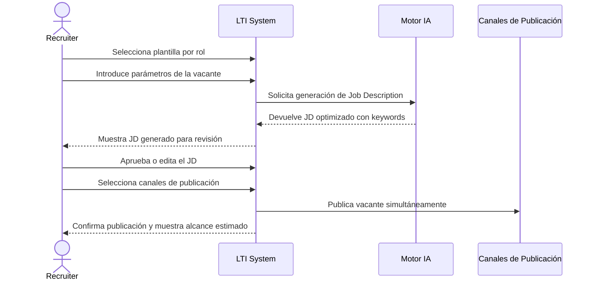
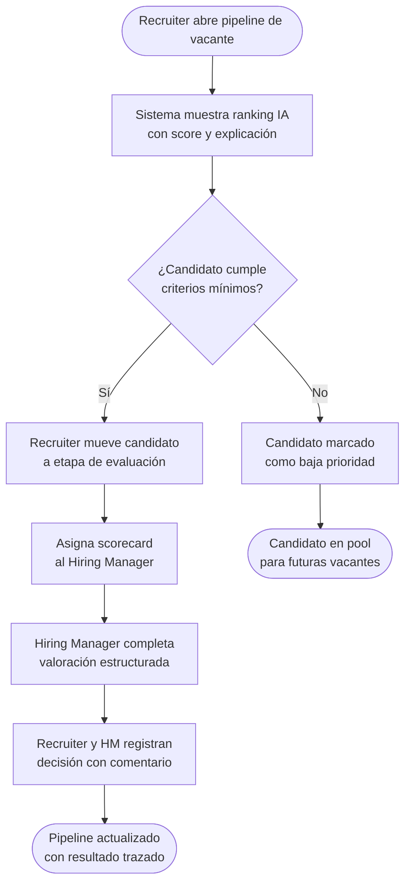
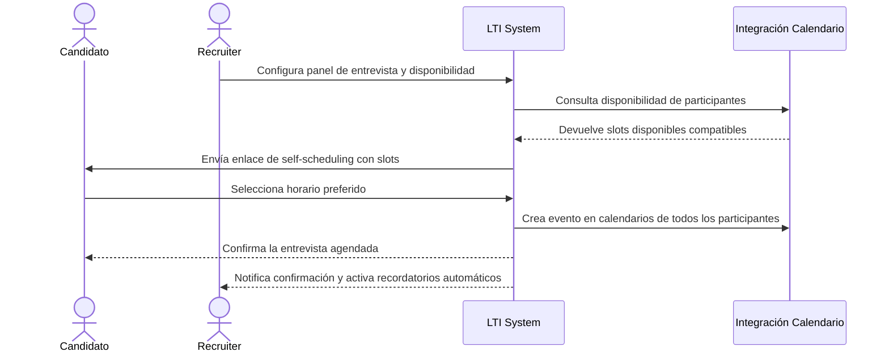
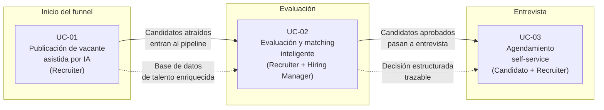

# Casos de Uso – Sistema ATS LTI

---

## Resumen del sistema analizado

LTI es un sistema ATS (Applicant Tracking System) diseñado para startups tecnológicas globales. Su propósito es centralizar y optimizar todo el proceso de reclutamiento en una única plataforma, eliminando la fragmentación de herramientas y reduciendo la carga operativa de los equipos de selección. El sistema combina automatización no-code, inteligencia artificial explicable e integraciones con herramientas del ecosistema tecnológico habitual (calendarios, HRIS, bolsas de empleo).

Se identifican tres actores principales: el **Recruiter**, responsable de gestionar vacantes, candidatos y el pipeline de selección; el **Hiring Manager**, que participa en la evaluación y toma de decisiones; y el **Candidato**, que interactúa con el sistema a través del proceso de postulación y programación de entrevistas. Adicionalmente, el motor de **IA del sistema** actúa como actor secundario de soporte en diversas etapas.

Los tres casos de uso seleccionados cubren etapas distintas del funnel de reclutamiento (inicio, evaluación y entrevista), involucran diferentes combinaciones de actores y demuestran las capacidades diferenciadoras del sistema (generación de contenido con IA, matching explicable y self-scheduling para candidatos). Todos son viables en el primer año de operación y generan impacto medible en tiempo, calidad de contratación y experiencia de usuario.

---

## Análisis de especificación

### Actores identificados

| Actor | Rol en el sistema |
|---|---|
| Recruiter | Crea vacantes, gestiona el pipeline, evalúa y comunica |
| Hiring Manager | Revisa candidatos, aporta feedback estructurado, toma decisiones |
| Candidato | Aplica a vacantes, agenda entrevistas, recibe comunicaciones |
| Motor IA | Genera contenido, realiza matching y recomendaciones |

### Funciones críticas identificadas

- Creación y publicación multicanal de vacantes con IA (§3.2, §3.8)
- Pipeline Kanban con evaluación y scoring (§3.3, §3.4)
- Scheduling self-service con integración de calendario (§3.5)
- Colaboración y decisiones estructuradas entre Recruiter y Hiring Manager (§3.6)
- Matching candidato–vacante con explicación IA (§3.8)
- Dashboard de métricas accionables (§3.9)

---

## Matriz de evaluación de candidatos a casos de uso

| Función candidata | Etapa del funnel | Actores distintos | Diferenciador IA/Automatización | Impacto medible | Viable año 1 | **Seleccionado** |
|---|---|---|---|---|---|---|
| Publicación de vacante con IA | Inicio | Recruiter | Generación IA de JD | Reducción time-to-publish | ✅ | ✅ |
| Matching y evaluación inteligente | Evaluación | Recruiter + Hiring Manager | IA explicable + scorecards | Mejora calidad de contratación | ✅ | ✅ |
| Scheduling self-service | Entrevista | Candidato + Recruiter | Integración calendario + self-service | Reducción tiempo coordinación | ✅ | ✅ |
| Publicación multicanal | Inicio | Recruiter | Automatización | Alcance de candidatos | ✅ | ❌ (incluido en UC-01) |
| Analytics de funnel | Transversal | Recruiter + Manager | Dashboard | Visibilidad operativa | ✅ | ❌ (soporte a otros UC) |
| Nurturing automatizado | Medio | Recruiter | No-code workflow | Retención de talento | ✅ | ❌ (menor prioridad) |

---

## Casos de uso documentados

---

### UC-01: Publicación de vacante asistida por IA

**Actor principal:** Recruiter  
**Objetivo:** Crear y publicar una vacante optimizada en múltiples canales con el apoyo del motor de IA del sistema, reduciendo el tiempo de elaboración del job description.

**Precondiciones:**
- El Recruiter tiene una necesidad de contratación aprobada.
- El sistema tiene acceso a plantillas de vacantes y al motor de IA.

**Postcondiciones:**
- La vacante queda publicada en los canales seleccionados.
- El sistema comienza a recibir candidaturas y registra el origen.

**Flujo básico:**

1. El Recruiter accede al módulo de vacantes y selecciona una plantilla por rol.
2. Introduce los parámetros clave (título, requisitos mínimos, equipo, nivel).
3. El motor de IA genera un job description optimizado con keywords relevantes.
4. El Recruiter revisa, edita si necesario y aprueba el contenido.
5. Selecciona los canales de publicación (bolsas de empleo, página de carreras, LinkedIn).
6. El sistema publica simultáneamente y muestra un resumen de alcance estimado.

**Flujos alternativos:**
- Si el Recruiter rechaza el JD generado, puede solicitar una nueva versión con contexto adicional o editar manualmente.
- Si un canal de publicación no está integrado, el sistema muestra aviso y excluye ese canal.

**Diferenciador:** La generación automática de JDs con IA elimina el tiempo de redacción desde cero y garantiza contenido más atractivo y optimizado para búsqueda, algo que los ATS tradicionales no ofrecen.

**Impacto de negocio:** Reducción del time-to-publish de vacante de horas a minutos. Mayor calidad y consistencia del contenido publicado. Ampliación del alcance a múltiples canales desde un único punto.

---

### UC-02: Evaluación y matching inteligente de candidatos

**Actor principal:** Recruiter (secundario: Hiring Manager, Motor IA)  
**Objetivo:** Evaluar y priorizar candidatos de forma eficiente y objetiva usando el ranking automático con explicación de IA y scorecards estructurados.

**Precondiciones:**
- Existe una vacante activa con candidatos en el pipeline.
- Los scorecards y criterios de evaluación están configurados para el rol.

**Postcondiciones:**
- Los candidatos tienen un score asignado con justificación visible.
- El Hiring Manager ha revisado y registrado su decisión estructurada.

**Flujo básico:**

1. El Recruiter abre el pipeline Kanban de la vacante y accede a la vista de candidatos.
2. El sistema muestra el ranking automático generado por IA con score y explicación por candidato.
3. El Recruiter filtra candidatos por score y revisa los perfiles priorizados.
4. Mueve los candidatos seleccionados a la etapa de evaluación y asigna scorecards al Hiring Manager.
5. El Hiring Manager completa el scorecard con sus valoraciones estructuradas.
6. Ambos registran una decisión (avanzar / descartar / en espera) con comentario visible en el hilo.

**Flujos alternativos:**
- Si el Recruiter no está de acuerdo con el ranking de IA, puede sobreescribir manualmente la prioridad.
- Si el Hiring Manager no completa el scorecard en plazo, el sistema envía recordatorio automático.

**Diferenciador:** A diferencia de otros ATS, el matching de LTI es explicable: muestra al Recruiter por qué un candidato encaja (skills, experiencia, contexto), no solo un número opaco. Esto genera confianza y reduce el sesgo.

**Impacto de negocio:** Mejora de la calidad de contratación al reducir la subjetividad. Reducción del tiempo de cribado. Mayor alineación entre Recruiter y Hiring Manager gracias a decisiones trazadas y justificadas.

---

### UC-03: Agendamiento self-service de entrevista

**Actor principal:** Candidato (secundario: Recruiter, sistema de calendario)  
**Objetivo:** Permitir al candidato seleccionar autónomamente el horario de su entrevista, eliminando la coordinación manual y mejorando su experiencia.

**Precondiciones:**
- El candidato ha superado la fase de cribado y está listo para entrevistar.
- El Recruiter ha configurado el panel de entrevistadores y sus disponibilidades en el sistema.
- Las integraciones con calendarios (Google/Outlook) están activas.

**Postcondiciones:**
- La entrevista queda agendada en los calendarios de todos los participantes.
- Se envían recordatorios automáticos al candidato y al panel.

**Flujo básico:**

1. El Recruiter configura el panel de entrevista y consulta la disponibilidad de los participantes vía integración de calendario.
2. El sistema genera los slots disponibles compatibles con todos los participantes.
3. El candidato recibe un enlace de self-scheduling con los slots disponibles.
4. El candidato selecciona su horario preferido desde el enlace (sin necesidad de cuenta).
5. El sistema crea el evento en los calendarios de todos los participantes automáticamente.
6. Se activan recordatorios automáticos (24h y 1h antes) para el candidato y el panel.

**Flujos alternativos:**
- Si ningún slot disponible se ajusta al candidato, puede solicitar al Recruiter ampliar la disponibilidad.
- Si el candidato necesita reagendar, accede al mismo enlace para seleccionar un nuevo slot.

**Diferenciador:** El self-scheduling convierte al candidato en protagonista activo del proceso, eliminando el intercambio de emails y reduciendo drásticamente el time-to-interview. Es una funcionalidad clave para la experiencia de candidato en un mercado tecnológico competitivo.

**Impacto de negocio:** Reducción del tiempo de coordinación de entrevistas de días a horas. Mejora notable de la experiencia del candidato (NPS). Liberación de tiempo del Recruiter para tareas de mayor valor.

---

## Diagramas Mermaid

### UC-01: Publicación de vacante asistida por IA

---

### UC-02: Evaluación y matching inteligente de candidatos

---

### UC-03: Agendamiento self-service de entrevista

---

## Tabla comparativa de casos de uso

| # | Caso de uso | Actor principal | Actores secundarios | Etapa del funnel | Diferenciador clave | Impacto principal | Prioridad |
|---|---|---|---|---|---|---|---|
| UC-01 | Publicación de vacante asistida por IA | Recruiter | Motor IA | Inicio | Generación de JD con IA | Reducción time-to-publish | Alta |
| UC-02 | Evaluación y matching inteligente | Recruiter | Hiring Manager, Motor IA | Evaluación | IA explicable + scorecards | Mejora calidad de contratación | Alta |
| UC-03 | Agendamiento self-service de entrevista | Candidato | Recruiter, Calendario | Entrevista | Self-scheduling sin fricción | Mejora experiencia candidato | Alta |

---

## Diagrama de interconexión entre los 3 casos de uso

---

*Documento generado el 21 de abril de 2026 a partir de las especificaciones del sistema LTI (ATSGeneralSpecs.md).*
