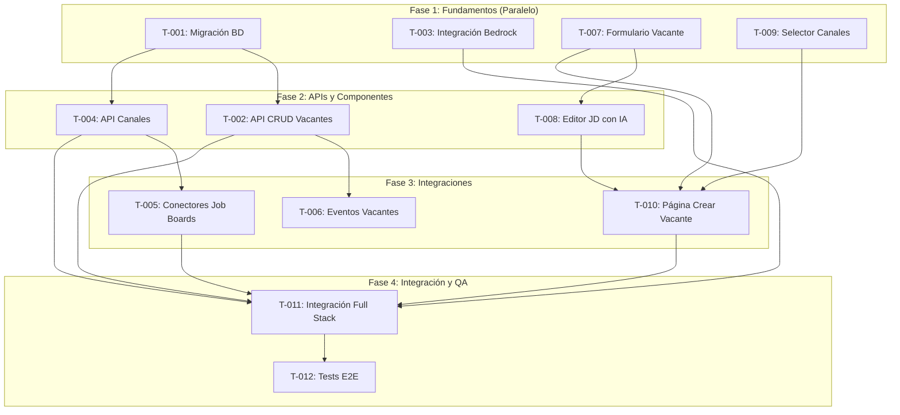

# US-01: Publicación de vacante asistida por IA

## Resumen Técnico

Implementación del flujo completo de creación y publicación de vacantes con asistencia de IA para la generación de job descriptions. El sistema permitirá a los Recruiters crear vacantes, generar descripciones optimizadas usando Amazon Bedrock, y publicar simultáneamente en múltiples canales de empleo integrados (LinkedIn, InfoJobs, etc.).

### Alcance Funcional
- Creación y edición de vacantes con formulario estructurado
- Generación automática de job descriptions usando IA (Amazon Bedrock)
- Edición manual y regeneración de JD
- Selección de canales de publicación
- Publicación multicanal simultánea
- Confirmación de publicación y métricas de alcance estimado
- Manejo de errores en canales no integrados

## Servicios Impactados

- [x] **vacancy-service** - Microservicio core de gestión de vacantes
- [x] **ai-service** - Servicio de integración con Amazon Bedrock
- [x] **channel-service** - Servicio de integración con job boards externos
- [x] **web-app** - Aplicación React del Recruiter
- [x] **notification-service** - Notificaciones de confirmación

## Dependencias Externas

| Servicio Externo | Propósito | Criticidad |
|------------------|-----------|------------|
| Amazon Bedrock (Claude/Titan) | Generación de job descriptions | Alta |
| LinkedIn Jobs API | Publicación de vacantes | Media |
| InfoJobs API | Publicación de vacantes | Media |
| Amazon SQS | Cola de eventos de publicación | Alta |
| Amazon SNS | Fan-out de notificaciones | Media |

## Tickets Generados

| ID | Título | Tipo | Prioridad | Estimación | Responsable | Etiquetas | Dependencias | Estado |
|----|--------|------|-----------|------------|-------------|-----------|--------------|--------|
| T-001 | Migración BD - Tablas vacantes y canales | task | Alta | 4h / 2 SP | Backend Dev | backend, db, vacancy-service | - | ⬜ Pendiente |
| T-002 | API REST - CRUD de vacantes | feature | Alta | 8h / 5 SP | Backend Dev | backend, api, vacancy-service | T-001 | ⬜ Pendiente |
| T-003 | Integración Bedrock - Generación JD con IA | feature | Alta | 8h / 5 SP | Backend Dev | backend, ia, ai-service | - | ⬜ Pendiente |
| T-004 | API REST - Endpoints de canales de publicación | feature | Alta | 6h / 3 SP | Backend Dev | backend, api, channel-service | T-001 | ⬜ Pendiente |
| T-005 | Conectores Job Boards - LinkedIn/InfoJobs | feature | Media | 12h / 8 SP | Backend Dev | backend, integracion, channel-service | T-004 | ⬜ Pendiente |
| T-006 | Eventos - Publicación de eventos de vacantes | task | Media | 4h / 2 SP | Backend Dev | backend, eventos, infra | T-002 | ⬜ Pendiente |
| T-007 | Componente UI - Formulario de vacante | feature | Media | 6h / 3 SP | Frontend Dev | frontend, ui, web-app | - | ⬜ Pendiente |
| T-008 | Componente UI - Editor JD con IA | feature | Media | 8h / 5 SP | Frontend Dev | frontend, ui, ia, web-app | T-007 | ⬜ Pendiente |
| T-009 | Componente UI - Selector de canales | feature | Media | 4h / 2 SP | Frontend Dev | frontend, ui, web-app | - | ⬜ Pendiente |
| T-010 | Página - Crear/Editar Vacante | feature | Media | 6h / 3 SP | Frontend Dev | frontend, page, web-app | T-007, T-008, T-009 | ⬜ Pendiente |
| T-011 | Integración Frontend-Backend - Flujo completo | task | Media | 6h / 3 SP | Full Stack | fullstack, integracion | T-002, T-003, T-004, T-010 | ⬜ Pendiente |
| T-012 | Tests E2E - Flujo publicación vacante | task | Baja | 6h / 3 SP | QA | qa, e2e, testing | T-011 | ⬜ Pendiente |

**Totales:** 12 tickets | 78 horas | 44 Story Points

## Diagrama de Dependencias

## Distribución por Sprints (Sugerida)

### Sprint 1 (Fundamentos)
- T-001: Migración BD
- T-003: Integración Bedrock
- T-007: Formulario Vacante
- T-009: Selector Canales

### Sprint 2 (Core Features)
- T-002: API CRUD Vacantes
- T-004: API Canales
- T-008: Editor JD con IA
- T-006: Eventos Vacantes

### Sprint 3 (Integración)
- T-005: Conectores Job Boards
- T-010: Página Crear Vacante
- T-011: Integración Frontend-Backend
- T-012: Tests E2E

## Notas de Planificación

### Riesgos Identificados

| Riesgo | Probabilidad | Impacto | Mitigación |
|--------|--------------|---------|------------|
| APIs de Job Boards con rate limiting | Alta | Medio | Implementar colas con reintentos exponenciales |
| Latencia en generación IA | Media | Medio | UX con indicadores de progreso y timeout configurable |
| Cambios en APIs externas | Media | Alto | Abstracción mediante adaptadores |
| Calidad variable del JD generado | Media | Medio | Prompts optimizados y opción de regenerar |

### Decisiones Técnicas Pendientes
- [ ] Definir modelo de Amazon Bedrock a utilizar (Claude Sonnet vs Titan)
- [ ] Confirmar disponibilidad de sandbox para LinkedIn Jobs API
- [ ] Validar límites de caracteres por canal de publicación

### Criterios de Done para la Historia
- [ ] Recruiter puede crear vacante con JD generado por IA
- [ ] Recruiter puede editar manualmente o regenerar JD
- [ ] Vacante se publica en al menos 2 canales integrados
- [ ] Sistema muestra confirmación con alcance estimado
- [ ] Canales no integrados muestran aviso apropiado
- [ ] Tests E2E cubren happy path y casos de error
